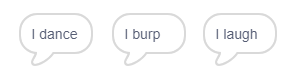

## The Analytical Engine

Let's program Ada's computer (called the 'Analytical Engine') to generate poetry.

+ Add this code to your 'Computer' sprite, so that it speaks when clicked:

```blocks
when this sprite clicked
say [Here is your poem...] for (2) secs
```

+ To create a random poem, first you'll need a __list__ of words to use. To create a new list, click the `Data`{:class="blockdata"} tab.

Let's use __verbs__ (action words) in the first line of your poem. Create a new list called 'verbs'.


+ Your new list will be empty. Click the `+` at the bottom of your empty list and add these verbs:


+ The first line in your poem will be the word "I", followed by a random verb. This is the code that you'll need to add:

```blocks
when this sprite clicked
say [Here is your poem...] for (2) secs
say (join [I ] (item (random v) of [verbs v])) for (2) secs
```

+ Test your code a few times. Your computer should say a random word from your verb list each time.




