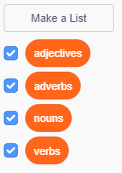

## More poetry

Your poem is quite short - let's add to it!

--- task ---

Let's use adverbs in the next line of your poem. An __adverb__ is a word that describes a verb. Create another list called adverbs, and add these 3 words:


--- /task ---

--- task ---

Add this line to your computer's code, to say a random adverb on the next line of your poem:


```blocks
when this sprite clicked
say [Here is your poem...] for (2) secs
say (join [I ] (item (random v) of [verbs v])) for (2) secs
+say (item (random v) of [adverbs v]) for (2) secs
```

--- /task ---

--- task ---

Test your code a few times. You should see a random poem each time.


--- /task ---

--- task ---

Add a list of nouns to your project. A __noun__ is a place or a thing.


--- /task ---

--- task ---

Add code to use the nouns in your poem.


```blocks
when this sprite clicked
say [Here is your poem...] for (2) secs
say (join [I ] (item (random v) of [verbs v])) for (2) secs
say (item (random v) of [adverbs v]) for (2) secs
+say (join [by the ] (item (random v) of [nouns v])) for (2) secs
```

--- /task ---

--- task ---

Add a list of adjectives to your project. An __adjective__ is a describing word.


--- /task ---

--- task ---

Add code to use the adjectives in your poem:


```blocks
when this sprite clicked
say [Here is your poem...] for (2) secs
say (join [I ] (item (random v) of [verbs v])) for (2) secs
say (item (random v) of [adverbs v]) for (2) secs
say (join [by the ] (item (random v) of [nouns v])) for (2) secs
+say (join [I feel ] (item (random v) of [adjectives v])) for (2) secs
```

--- /task ---

--- task ---

You can click the boxes next to your lists to hide them.



--- /task ---

--- task ---

Test out your new poem.

--- /task ---
