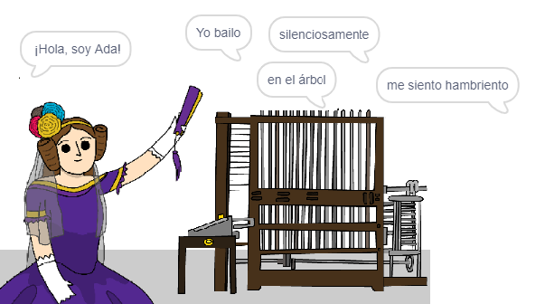

\--- no-print \---

Esta es una versión de **Scratch 3** del proyecto. También hay una [versión del proyecto en Scratch 2](https://projects.raspberrypi.org/en/projects/poetry-generator-scratch2).

\--- /no-print \---

## Introducción

You are going to learn how to program your own poetry generator!

\--- no-print \---

  <iframe allowtransparency="true" width="485" height="402" src="https://scratch.mit.edu/projects/embed/77844926/?autostart=false" frameborder="0" scrolling="no"></iframe>
  

\--- /no-print \---

\--- print-only \---

\--- /print-only \---

## \--- colapso \---

## title: Lo que vas a aprender

+ Variables;
+ Lists and random list items;
+ Repetition (the `repeat`{:class="block3control"} block).

\--- /collapse \---

## \--- collapse \---

## title: Lo que vas a necesitar

#### Hardware

+ Una computadora capaz de hacer correr Scratch 3

#### Software

+ Scratch 3 (ya sea [online](http://rpf.io/scratchon){:target="_blank"} u [offline](http://rpf.io/scratchoff) {:target="_blank"})

#### Descargas

The starter project can be found [here](http://rpf.io/p/en/poetry-generator-go){:target="_blank"}.

\--- /colapso \---

## \--- collapse \---

## title: Información adicional para educadores

This project has been created to celebrate [Ada Lovalace Day](https://findingada.com). If you're a teacher, you can download a School Resource Pack containing which also contains an an assembly plan ([downloads.codeclub.org.uk/ada.zip](http://downloads.codeclub.org.uk/ada.zip)), to introduce children to Ada and her revolutionary ideas.

\--- no-print \---

Si necesitas imprimir este proyecto, usa la [versión para imprimir](https://projects.raspberrypi.org/en/projects/poetry-generator/print){:target="_blank"}.

\--- /no-print \---

You can download the [completed project](http://rpf.io/p/en/poetry-generator-get).

\--- /collapse \---