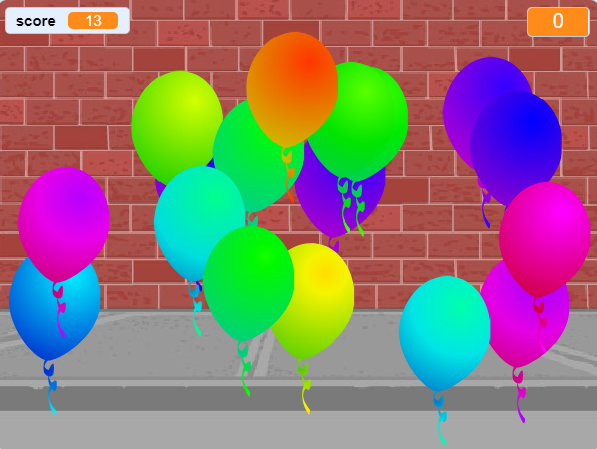

## ¿Qué sigue?

Echa un vistazo al proyecto [Globos](https://projects.raspberrypi.org/es-ES/projects/balloons) de Scratch.

--- no-print ---

Elimina los globos haciendo clic en ellos.

  <iframe allowtransparency="true" width="485" height="402" src="https://scratch.mit.edu/projects/embed/299206746/?autostart=false" frameborder="0" scrolling="no"></iframe>
  

--- /no-print ---

--- print-only ---

--- /print-only ---

***
Este proyecto fue traducido por voluntarios:

Valeria Pérez Suárez

Laura Lurati

José María Honrado

Gracias a los voluntarios, podemos dar a las personas de todo el mundo la oportunidad de aprender en su propio idioma. Puede ayudarnos a llegar a más personas ofreciéndose como voluntario para traducir; más información en [rpf.io/translate](https://rpf.io/translate).