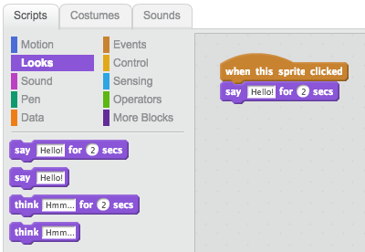

## Ada Lovelace

En 1842, Ada Lovelace escribió sobre el uso de una máquina llamada 'Motor Analítico' para hacer cálculos, ¡y es visto como el primer programador de computadoras del mundo! Ada también fue la primera en ver que las computadoras podían ser más que simples calculadoras.

+ Abra el proyecto Scratch 'Poetry Generator' en línea en <a href="http://jumpto.cc/poetry-go" target="_blank">jumpto.cc/poetry-go</a> o descargue desde <a href="http://jumpto.cc/poetry-get" target="_blank">jumpto.cc/poetry-get</a> y luego ábralo si está usando el editor fuera de línea.

+ Haga clic en su sprite 'Ada' y haga clic en la pestaña `Events`{: class = "blockevents"} en la sección de codificación 'Scripts'. Arrastre el `cuando este objeto haga clic en`{: class = "blockevents"} bloque en el área de codificación a la derecha.

¡Cualquier código agregado debajo de este bloque se ejecutará cuando se haga clic en Ada!

+ Haga clic en la pestaña `Looks`{: class = "blocklooks"}, y arrastre `diga`{: class = "blocklooks"} `¡Hola!` `por 2 segundos`{bloque de clases = "bloqueantes"} debajo del código que ya ha agregado.

+ Haga clic en Ada, y debería verla hablar con usted.

