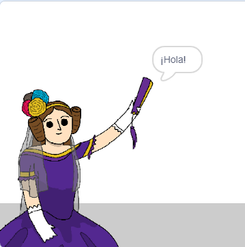

## Ada Lovelace

En 1842, Ada Lovelace escribió sobre el uso de una máquina llamada 'Motor Analítico' para hacer cálculos, ¡y es visto como el primer ordenador del mundo! Ada también fue la primera en ver que los ordenadores podían ser más que simples calculadoras.

\--- task \---

Abre el proyecto de iniciación en el "Generador de Poesías" de Scratch.

**Online**: abre el [poryecto de iniciación](http://rpf.io/poetry-on){:target="_blank"}.

If you have a Scratch account you can make a copy by clicking **Remix**.

**Offline**: open the [starter project](http://rpf.io/p/en/beat-the-goalie-go){:target="_blank"} in the offline editor.

If you need to download and install the Scratch offline editor, you can find it at [rpf.io/scratchoff](http://rpf.io/scratchoff){:target="_blank"}.

\--- /task \---

\--- task \---

Click on your 'Ada' sprite, and click the `Events`{:class="block3events"} tab in the 'Scripts' coding section. Drag the `when this sprite clicked`{:class="block3events"} block onto the coding area on the right.


Any code added underneath this block will run when Ada is clicked!

\--- /task \---

\--- task \---

Click the `Looks`{:class="block3looks"} tab, and drag the `say`{:class="block3looks"} `Hello!` `for 2 secs`{:class="block3looks"} block underneath the `when this sprite clicked`{:class="block3events"} block you've already added.


```blocks3
al hacer clic en este objeto
decir [¡Hola!] durante (2) segundos
```

\--- /task \---

\--- task \---

Click on Ada, and you should see her talk to you.



\--- /task \---