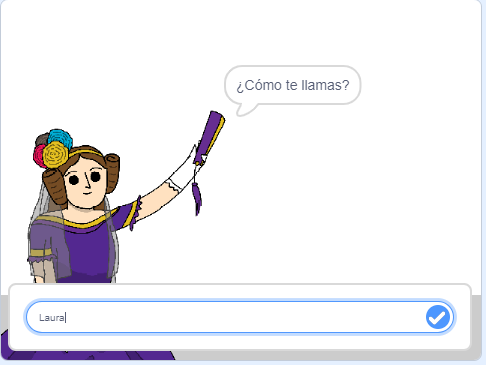
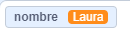
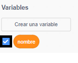
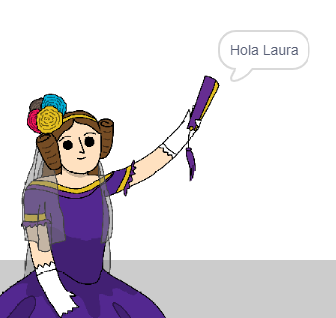

## Diciéndole a Ada tu nombre

Ada se ha presentado, ¡pero no sabe tu nombre!

--- task ---

Arrastra un bloque `preguntar`{:class="block3sensing"} (de la sección `sensores`{:class="block3sensing"}) a tu código. Tu código debería parecerse a esto:


```blocks3
al hacer clic en este objeto
decir [¡Hola, soy Ada!] durante (2) segundos
+ preguntar [¿Cómo te llamas?] y esperar
```

--- /task ---

--- task ---

Haz clic en Ada para probar tu código. Ada debería preguntarte tu nombre, ¡el cual podrás escribir en ese momento!



--- /task ---

--- task ---

Podemos usar una **variable** para guardar tu nombre. Haz clic en `Variables`{:class="block3variables"}, y luego a "Crear una Variable". Como esta variable va a contener tu nombre, llamémosla... `nombre`{:class="block3variables"}!

[[[generic-scratch3-add-variable]]]

--- /task ---

--- task ---

Para guardar tu nombre, haz clic en la pestaña `Variables`{:class="block3variables"}, y luego arrastra el bloque `dar a nombre el valor 0`{:class="block3variables"} al final de tu código.


```blocks3
cuando se haga clic en la imagen
decir [¡Hola, soy Ada!] durante (2) segundos
preguntar [¿Cómo te llamas?] y esperar
+ dar a [nombre v] el valor [0]
```

--- /task ---

--- task ---

Utiliza el bloque `respuesta`{:class="block3sensing"} para almacenar la respuesta que escribas.


```blocks3
cuando se haga clic en la imagen
decir [¡Hola, soy Ada!] durante (2) segundos
preguntar [¿Cómo te llamas?] y esperar
 dar a [nombre v] el valor (respuesta:: +)
```

--- /task ---

--- task ---

Haz clic en Ada para probar tu código, y luego escribe tu nombre cuando te lo pregunten. Deberías ver que tu nombre se ha guardado en la variable `nombre`{:class="block3variables"}.



--- /task ---

--- task ---

Ahora puedes usar tu nombre en tu código. Añade este código:


```blocks3
cuando se haga clic en la imagen
decir [¡Hola, soy Ada!] durante (2) segundos
preguntar [¿Cómo te llamas?] y esperar
 dar a [nombre v] el valor(respuesta)
+ decir (unir [¡Hola!] (nombre)) durante (2) segundos 
```

Para crear este código:

1. Arrastra el bloque `unir`{:class="blockoperators"} en el bloque `deciri`{:class="blocklooks"} block
    
    ```blocks3
    decir (unir [manzana] [plátano] :: +) durante (2) segundos
    ```

2. Añade el bloque `nombre`{:class="blockdata"} al bloque `unir`{:class="blockoperators"}.
    
    ```blocks3
    decir (unir [Hola] (nombre:: variables +)) durante (2) segundos
    ```
    
    --- /task ---

--- task ---

Para esconder la variable `nombre`{:class="block3variables"} en la pantalla, haz clic en la marca al lado de la variable.



--- /task ---

--- task ---

Pon a prueba tu código. Ada te debería decir hola, ¡usando tu nombre!



Si no hay espacio entre la palabra "Hola" y tu nombre, ¡necesitarás añadir un espacio en el código tú mismo!

--- /task ---

Si no hay espacio entre. la palabra "Hola" y tu nombre, ¡necesitarás añadir un espacio en el código tú mismo

Finalmente, añade este código para explicar lo que hacer a continuación:


```blocks3
al hacer clic en este objeto
decir [¡Hola, soy Ada!] durante (2) segundos
preguntar [¿Cómo te llamas?] y esperar
dar a [nombre v] el valor (respuesta)
decir (unir [¡Hola!] (nombre)) durante (2) segundos 
+ decir [Haz clic en el ordenador para generar el poema.] durante (2) segundos 
```

--- /task ---

--- task ---

Prueba el código de Ada una última vez, para asegurarte que todo funciona.

--- /task ---