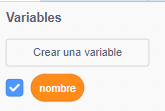

## Diciéndole a Ada tu nombre

Ada se presentó, ¡pero no sabe tu nombre!

+ Arrastre un bloque `ask`{: class = "blocksensing"} (de la sección `sensing`{: class = "blocksensing"}) a su código. Así es como debería verse su código:

```blocks
cuando este duende hizo clic diga [¡Hola, soy Ada!] durante (2) segundos, pregunte [¿Cuál es su nombre?] y espere
```

+ Haga clic en Ada para probar su código. ¡Ada debería preguntarte tu nombre, que puedes escribir!


+ Podemos usar una variable **** para almacenar su nombre. Haga clic en `Data`{: class = "blockdata"}, y luego en 'Make a Variable'. Como esta variable se usará para almacenar su nombre, llamemos a la variable ... `nombre`{: clase = "blockdata"}!


+ Para almacenar su nombre, haga clic en la pestaña `Data`{: class = "blockdata"}, y luego arrastre el bloque de `nombres`{: class = "blockdata"} al final de su código.


+ Use el bloque de `respuestas`{: clase = "bloquesensing"} para almacenar la respuesta que ingrese.


+ Haga clic en Ada para probar su código, e ingrese su nombre cuando se le pregunte. Debería ver que su nombre ha sido almacenado en la variable `name`{: class = "blockdata"}.


+ Ahora puede hacer uso de su nombre en su código. Agrega este código:

```blocks
decir (unir [Hola] (nombre))
```

Para crear este código, primero arrastre un bloque `join`{: class = "blockoperators"} al bloque `say`{: class = "blocklooks"}, y luego agregue su `nombre`{: class = "blockdata"} bloquear en el bloque `join`{: class = "blockoperators"}.


+ Para ocultar su variable `name`{: class = "blockdata"} en el escenario, haga clic en la marca al lado de la variable.



+ Pruebe su nuevo código. ¡Ada debería saludarte usando tu nombre!


Si no hay espacio entre la palabra 'Hola' y su nombre, ¡tendrá que agregar un espacio al código usted mismo!

+ Finalmente, agregue este código para explicar qué hacer a continuación:

```blocks
diga [¡Haga clic en la computadora para generar un poema!] durante (2) segundos
```

+ Pruebe el código de Ada una vez más, para asegurarse de que todo funciona. Así es como debe verse su código:

```blocks
cuando este objeto hizo clic diga [Hola, soy Ada!] durante (2) segundos pregunte [¿Cuál es su nombre?] y espere a que [nombre v] responda (diga) (únase [Hola] (nombre)) a (2 ) segs dicen [Haga clic en la computadora para generar un poema.] durante (2) segundos 
```