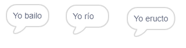

## El motor analítico

Vamos a programar la computadora de Ada (llamada el 'Motor Analítico') para generar poesía.

+ Agregue este código a su sprite 'Computer', para que hable al hacer clic:

```blocks
cuando este duende hizo clic diga [Aquí está su poema ...] durante (2) segundos
```

+ Para crear un poema al azar, primero se necesita un **lista** de palabras a utilizar. Para crear una nueva lista, haga clic en la pestaña `Data`{: class = "blockdata"}.

Usemos **verbos** (palabras de acción) en la primera línea de su poema. Crea una nueva lista llamada 'verbos'.


+ Tu nueva lista estará vacía. Haga clic en el `+` en la parte inferior de su lista vacía y agregue estos verbos:


+ La primera línea de tu poema será la palabra "I", seguida de un verbo aleatorio. Este es el código que deberá agregar:

```blocks
cuando este objeto hizo clic diga [Aquí está su poema ...] durante (2) segundos diga (únase [I] (elemento (v al azar) de [verbos v]) durante (2) segundos
```

+ Pruebe su código algunas veces. Su computadora debe decir una palabra aleatoria de su lista de verbos cada vez.

