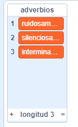
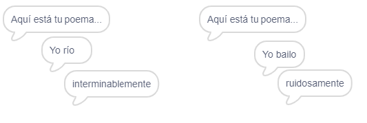
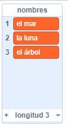
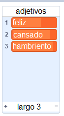
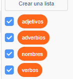

## Más poesía

Tu poema es bastante corto, ¡vamos a añadir más versos!

--- task ---

Vamos a usar adverbios en la siguiente línea de tu poema. Un **adverbio** es una palabra que describe un verbo. Crea otra lista que se llame adverbios, y añade estas 3 palabras:



--- /task ---

--- task ---

Añade esta línea a tu código para que aparezca un adverbio al azar en la siguiente línea de tu poema:


```blocks3
al hacer clic en este objeto
decir [Aquí está tu poema...] durante (2) segundos
decir (unir [Yo ](elemento (número aleatorio entre (1) y (longitud de [verbos v])) de [verbos v])) durante (2) segundos
+ decir (elemento (número aleatorio entre (1) y (longitud de [adverbios v])) de [adverbios v]) durante (2) segundos
```

--- /task ---

--- task ---

Prueba tu código varias veces. Deberías ver un poema al azar cada vez.



--- /task ---

--- task ---

Añade una lista de nombres a tu proyecto. Un **nombre** es un lugar o una cosa.



--- /task ---

--- task ---

Añade este código para usar nombres en vuestro poema.


```blocks3
al hacer clic en este objeto
decir [Aquí está tu poema...] durante (2) segundos
decir (unir [Yo ](elemento (número aleatorio entre (1) y (longitud de [verbos v])) de [verbos v])) durante (2) segundos
decir (elemento (número aleatorio entre (1) y (longitud de [adverbios v])) de [adverbios v]) durante (2) segundos
decir (unir [en](elemento (número aleatorio entre (1) y (longitud de [nombres v])) de [nombres v])) durante (2) segundos
```

--- /task ---

--- task ---

Añade una lista de adjetivos a tu proyecto. Un **adjetivo** es una palabra descriptiva.



--- /task ---

--- task ---

Añade código para usar adjetivos en tu poema:


```blocks3
al hacer clic en este objeto
decir [Aquí está tu poema...] durante (2) segundos
decir (unir [Yo ](elemento (número aleatorio entre (1) y (longitud de [verbos v])) de [verbos v])) durante (2) segundos
decir (elemento (número aleatorio entre (1) y (longitud de [adverbios v])) de [adverbios v]) durante (2) segundos
decir (unir [en ](elemento (número aleatorio entre (1) y (longitud de [nombres v])) de [nombres v])) durante (2) segundos
+ decir (unir [me siento ](elemento (número aleatorio entre (1) y (longitud 
de [adjetivos v])) de [adjetivos v])) durante (2) segundos
```

--- /task ---

--- task ---

Puedes hacer clic en las cajas al lado de tus listas para esconderlas.



--- /task ---

--- task ---

Prueba tu nuevo poema.

--- /task ---