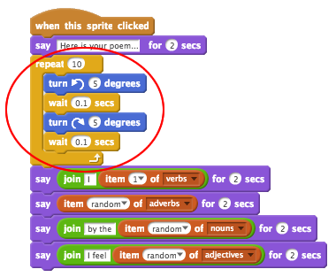
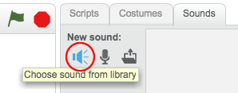
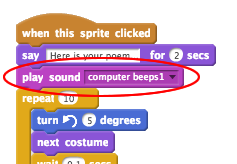

## Animar el motor analítico

Animemos su computadora, para que parezca que está generando poesía.

+ Haga clic en el sprite de su computadora y agregue este código después del primer bloque de `decir`{: class = "blocklooks"}:

```blocks
repetir (10) girar a la izquierda (5) grados esperar (0.1) segundos girar a la derecha (5) grados esperar (0.1) segundos
```

Así es como debería verse su código:



Encontrará que los bloques `repeat`{: class = "blockcontrol"} y `wait`{: class = "blockcontrol"} están en la sección `Control`{: class = "blockcontrol"}.

+ Prueba tu proyecto ¡Deberías ver la computadora temblar antes de producir un poema!


+ Haga clic en la pestaña 'Sonidos' y haga clic en 'Elegir sonido de la biblioteca'.



+ Elija un sonido 'computer beeps' y haga clic en OK.


+ Agrega un bloque de sonido `play`{: class = "blocksound"}, para reproducir tu sonido justo antes de que comience la animación.

