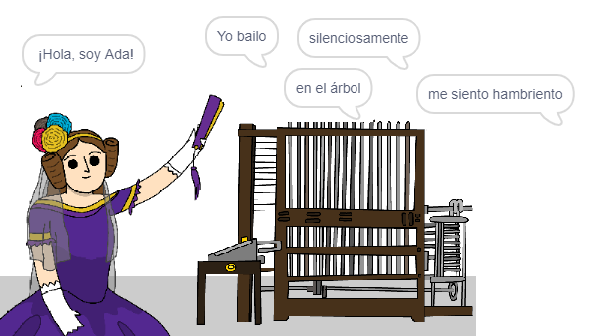

\--- no-print \---

Esta es la versión **Scratch 3** del proyecto. También hay una [versión del proyecto en Scratch 2](https://projects.raspberrypi.org/en/projects/poetry-generator-scratch2).

\--- /no-print \---

## Introducción

¡Vas a aprender a programar tu propio generador de poesías!

\--- no-print \---

  <iframe allowtransparency="true" width="485" height="402" src="https://scratch.mit.edu/projects/embed/77844926/?autostart=false" frameborder="0" scrolling="no"></iframe>
  

\--- /no-print \---

\--- print-only \---

\--- /print-only \---

## \--- collapse \---

## title: Lo que vas a aprender

+ Variables;
+ Listas y elementos aleatorios;
+ Repetición (el bloque `repetir`{:class="block3control"}).

\--- /collapse \---

## \--- collapse \---

## title: Lo que vas a necesitar

#### Equipo

+ Una computadora capaz de correr Scratch 3

#### Programas

+ Scratch 3 (ya sea [en línea](http://rpf.io/scratchon){:target="_blank"} o [sin conexión](http://rpf.io/scratchoff) {:target="_blank"})

#### Descargas

El proyecto de iniciación puede encontrarse [aquí](http://rpf.io/p/en/poetry-generator-go){:target="_blank"}.

\--- /collapse \---

## \--- collapse \---

## title: Información adicional para educadores

El proyecto se ha creado para celebrar [ El día de Ada Lovelace](https://findingada.com). If you're a teacher, you can download a School Resource Pack which also contains an assembly plan ([downloads.codeclub.org.uk/ada.zip](http://downloads.codeclub.org.uk/ada.zip)), to introduce children to Ada and her revolutionary ideas.

\--- no-print \---

Si necesitas imprimir este proyecto, por favor utiliza la [versión para imprimir](https://projects.raspberrypi.org/en/projects/poetry-generator/print){:target="_blank"}.

\--- /no-print \---

Puedes encontrar el [ proyecto completo aquí ](http://rpf.io/p/en/poetry-generator-get){:target="_blank"}.

\--- /collapse \---