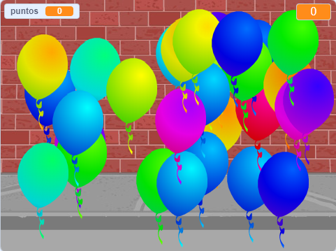

## ¿Qué sigue?

Echa un vistazo al proyecto [Globos](https://projects.raspberrypi.org/es-LA/projects/balloons) de Scratch.

--- no-print ---

Haz explotar los globos haciendo clic en ellos.

  <iframe allowtransparency="true" width="485" height="402" src="https://scratch.mit.edu/projects/embed/299206746/?autostart=false" frameborder="0" scrolling="no"></iframe>
  

--- /no-print ---

--- print-only ---

--- /print-only ---