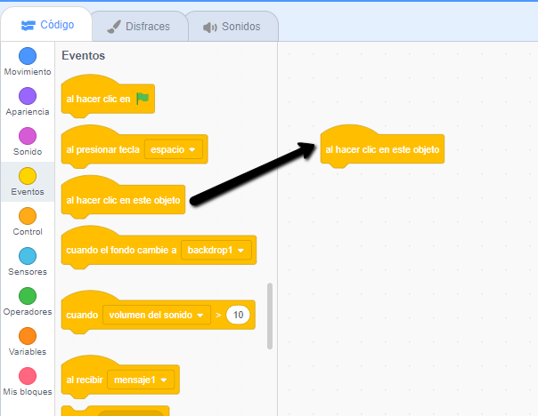
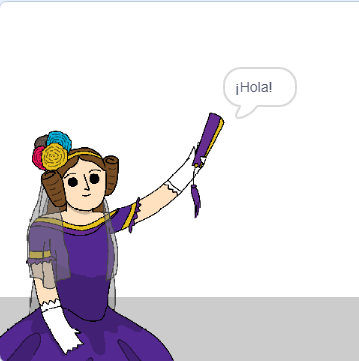

## Ada Lovelace

En 1842, Ada Lovelace escribió sobre el uso de una máquina llamada 'Motor Analítico' para hacer cálculos, ¡y por eso es vista como la primera programadora de computadores del mundo! Ada también fue la primera en ver que las computadoras podían ser más que simples calculadoras.

\--- task \---

Abre el proyecto de iniciación "Generador de Poesías" en Scratch.

**En línea**: abre el [proyecto de iniciación](http://rpf.io/poetry-on){:target="_blank"}.

Si tienes una cuenta de Scratch puedes hacer una copia haciendo clic en **Reinventar**.

**Sin conexión**: abre el [proyecto de iniciación](http://rpf.io/p/en/beat-the-goalie-go){:target=_blank"} en el editor offline.

Si necesitas descargar e instalar el editor sin conexión de Scratch, puedes encontrarlo en [rpf.io/scratchoff](http://rpf.io/scratchoff){:target="_blank"}.

\--- /task \---

\--- task \---

Haz clic en la imagen de "Ada", y haz click en la pestaña `Eventos`{:class="block3events"} en la sección de codificación "Programas". Arrastra el bloque `al hacer clic en este objeto`{:class="block3events"} en el área de codificación a la derecha.




¡Cualquier código añadido por debajo de este bloque se ejecutará cuando se haga clic sobre Ada!

\--- /task \---

\--- task \---

Click the `Looks`{:class="block3looks"} tab, and drag the `say`{:class="block3looks"} `Hello!` `for 2 secs`{:class="block3looks"} block underneath the `when this sprite clicked`{:class="block3events"} block you've already added.


```blocks3
when this sprite clicked
say [Hello!] for (2) seconds
```

\--- /task \---

\--- task \---

Click on Ada, and you should see her talk to you.



\--- /task \---