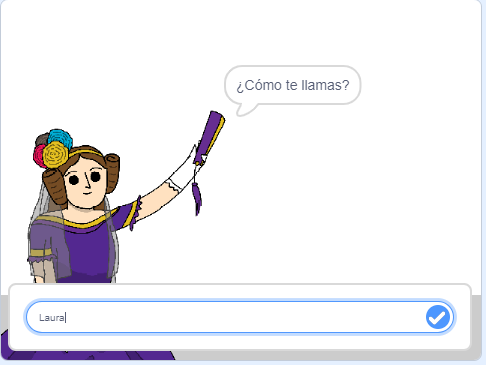
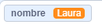
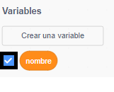
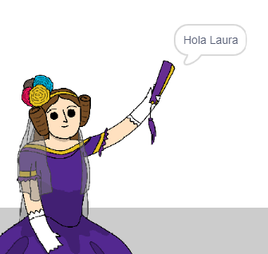

## Diciéndole a Ada tu nombre

Ada se ha presentado, ¡pero no sabe tu nombre!

\--- task \---

Arrastra un bloque `preguntar`{:class="block3sensing"} (de la sección `sensores`{:class="block3sensing"}) a tu código. Tu código debería parecerse a esto:


```blocks3
when this sprite clicked
say [Hi, I'm Ada!] for (2) seconds
+ ask [What's your name?] and wait
```

\--- /task \---

\--- task \---

Haz clic en Ada para probar tu código. Ada debería preguntarte tu nombre, ¡el cual podrás escribir en ese momento!



\--- /task \---

\--- task \---

Podemos usar una **variable** para guardar tu nombre. Click `Variables`{:class="block3variables"}, and then 'Make a Variable'. Como esta variable va a contener tu nombre, llamémosla... `nombre`{:class="block3variables"}!

[[[generic-scratch3-add-variable]]]

\--- /task \---

\--- task \---

To store your name, click the `Variables`{:class="block3variables"} tab, and then drag the `set name`{:class="block3variables"} block onto the end of your code.


```blocks3
when this sprite clicked
say [Hi, I'm Ada!] for (2) seconds
ask [What's your name?] and wait
+ set [name v] to [0]
```

\--- /task \---

\--- task \---

Utiliza el bloque `respuesta`{:class="block3sensing"} para almacenar la respuesta que escribas.


```blocks3
when this sprite clicked
say [Hi, I'm Ada!] for (2) seconds
ask [What's your name?] and wait
set [name v] to (answer :: +)
```

\--- /task \---

\--- task \---

Haz clic en Ada para probar tu código, y luego escribe tu nombre cuando te lo pregunten. Deberías ver que tu nombre se ha guardado en la variable `nombre`{:class="block3variables"}.



\--- /task \---

\--- task \---

Ahora puedes usar tu nombre en tu código. Añade este código:


```blocks3
when this sprite clicked
say [Hi, I'm Ada!] for (2) seconds
ask [What's your name?] and wait
set [name v] to (answer)
+say (join [Hi ] (name)) for (2) seconds 
```

Para crear este código:

1. Arrastra el bloque `unir`{:class="blockoperators"} al bloque `decir`{:class="blocklooks"} block
    
    ```blocks3
    say (join [apple] [banana] :: +) for (2) seconds
    ```

2. Añade el bloque `nombre`{:class="blockdata"} al bloque `unir`{:class="blockoperators"}.
    
    ```blocks3
    say (join [Hi] (name :: variables +)) for (2) seconds
    ```

\--- /task \---

\--- task \---

Para esconder la variable `nombre`{:class="block3variables"} en la pantalla, haz clic en la marca al lado de la variable.



\--- /task \---

\--- task \---

Prueba tu nuevo código. Ada debería decirte hola, ¡usando tu nombre!



Si no hay espacio entre la palabra "Hola" y tu nombre, ¡necesitarás añadir un espacio en el código tú mismo!

\--- /task \---

\--- task \---

Finalmente, añade este código para explicar qué hacer a continuación:


```blocks3
when this sprite clicked
say [Hi, I'm Ada!] for (2) seconds
ask [What's your name?] and wait
set [name v] to (answer)
say (join [Hi ] (name)) for (2) seconds 
+ say [Click the computer to generate a poem.] for (2) seconds 
```

\--- /task \---

\--- task \---

Prueba el código de Ada una última vez, para asegurarte que todo funciona.

\--- /task \---