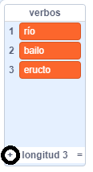
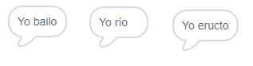

## El motor analítico

Vamos a programar el computador de Ada (llamado el 'Motor Analítico') para generar poesía.

--- task ---

Añade este código a tu objeto "computadora", para que hable cuando le hagas clic:


```blocks3
when this sprite clicked
say [Aquí está tu poema…] for (2) seconds
```

--- /task ---

--- task ---

Para crear un poema aleatorio, primero necesitarás una **lista** de palabras que usar. Para crear una lista nueva, haz clic en la pestaña `Variables`{:class="block3variables"}.

Vamos a usar **verbos** (palabras de acción) en la primera línea de tu poema. Crea una nueva lista llamada `verbos`{:class="block3variables"}.

[[[generic-scratch3-make-list]]]

--- /task ---

--- task ---

Tu nueva lista estará vacía. Haz clic en `+` al final de tu lista vacía y añade estos verbos conjugados en primera persona:



--- /task ---

--- task ---

La primera línea de tu poema debe ser la palabra "Yo", seguida de un verbo al azar.

Para crear una línea de poesía, necesitas:

1. `número aleatorio`{:class="block3operators"} entre `1` y `la longitud de la lista de verbos`{:class="block3variables"}:
    
    ```blocks3
    (pick random (1) to (length of [verbos v]))
    ```

2. Usa este bloque para escoger un `elemento`{:class="block3variables"} al azar de la lista de `verbos`{:class="block3variables"}:
    
    ```blocks3
    (item (pick random (1) to (length of [verbos v]) :: +) of [verbos v])
    ```

3. `Unir`{:class="block3operators"} "Yo " con el verbo al azar para crear la primera línea de tu poema:
    
    ```blocks3
    (join [Yo ] (item (pick random (1) to (length of [verbos v])) of [verbos v] :: +))
    ```

4. Usa un bloque `decir`{:class="block3looks"} para mostrar una línea de poesía:
    
    ```blocks3
    say (join [Yo ](item (pick random (1) to (length of [verbos v])) of [verbos v]) :: +) for (2) seconds
    ```

Tu código debe parecerse a esto:


```blocks3
when this sprite clicked
say [Aquí está tu poema…] for (2) seconds
+ say (join [Yo ](item (pick random (1) to (length of [verbos v])) of [verbos v])) for (2) seconds
```

--- /task ---

--- task ---

Prueba tu código unas cuantas veces. Tu computadora debería elegir una palabra al azar de la lista de `verbos`{:class="block3variables"} cada vez.



--- /task ---