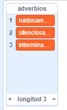

## Más poesía

Tu poema es bastante corto, ¡vamos a añadir más versos!

--- task ---

Vamos a usar adverbios en la siguiente línea de tu poema. Un **adverbio** es una palabra que describe un verbo. Crea otra lista que se llame adverbios, y añade estas 3 palabras:



--- /task ---

--- task ---

Añade esta línea a tu código para que aparezca un adverbio al azar en la siguiente línea de tu poema:


```blocks3
when this sprite clicked
say [Aquí está tu poema…] for (2) seconds
say (join [Yo ](item (pick random (1) to (length of [verbos v])) of [verbos v])) for (2) seconds
+say (item (pick random (1) to (length of [adverbios v])) of [adverbios v]) for (2) seconds
```

--- /task ---

--- task ---

Prueba tu código varias veces. Deberías ver un poema al azar cada vez.


--- /task ---

--- task ---

Añade una lista de nombres a tu proyecto. Un **nombre** es un lugar o una cosa.


--- /task ---

--- task ---

Añade este código para usar nombres en tu poema.


```blocks3
when this sprite clicked
say [Aquí está tu poema…] for (2) seconds
say (join [Yo ](item (pick random (1) to (length of [verbos v])) of [verbos v])) for (2) seconds
say (item (pick random (1) to (length of [adverbios v])) of [adverbios v]) for (2) seconds
+say (join [por el ](item (pick random (1) to (length of [nombres v])) of [nombres v])) for (2) seconds
```

--- /task ---

--- task ---

Añade una lista de adjetivos a tu proyecto. Un **adjetivo** es una palabra descriptiva.


--- /task ---

--- task ---

Añade código para usar adjetivos en tu poema:


```blocks3
when this sprite clicked
say [Aquí está tu poema…] for (2) seconds
say (join [Yo ](item (pick random (1) to (length of [verbos v])) of [verbos v])) for (2) seconds
say (item (pick random (1) to (length of [adverbios v])) of [adverbios v]) for (2) seconds
say (join [por el ](item (pick random (1) to (length of [nombres v])) of [nombres v])) for (2) seconds
+ say (join [Me siento ](item (pick random (1) to (length of [adjetivos v])) of [adjetivos v])) for (2) seconds
```

--- /task ---

--- task ---

Puedes hacer clic en las cajas al lado de tus listas para esconderlas.


--- /task ---

--- task ---

Prueba tu nuevo poema.

--- /task ---