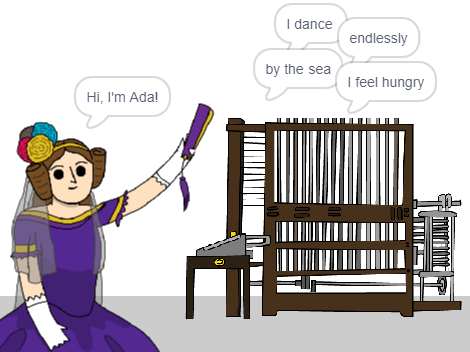

\--- no-print \---

This is the **Scratch 3** version of the project. There is also a [Scratch 2 version of the project](https://projects.raspberrypi.org/en/projects/poetry-generator-scratch2).

\--- /no-print \---

## Esittely

You are going to learn how to program your own poetry generator!

\--- no-print \---

  <iframe allowtransparency="true" width="485" height="402" src="https://scratch.mit.edu/projects/embed/77844926/?autostart=false" frameborder="0" scrolling="no"></iframe>
  

\--- /no-print \---

\--- print-only \---

\--- /print-only \---

## \--- collapse \---

## title: Mitä tulet oppimaan

+ Variables;
+ Lists and random list items;
+ Repetition (the `repeat`{:class="block3control"} block).

\--- /collapse \---

## \--- collapse \---

## title: Mitä tarvitset

#### Laitteisto

+ Tietokone, joka pystyy käyttämään Scratch 3 -ohjelmaa

#### Ohjelmisto

+ Scratch 3 (joko [verkossa](http://rpf.io/scratchon){:target="_blank"} tai [koneelle asennettuna](http://rpf.io/scratchoff){:target="_blank"})

#### Ladattavat tiedostot

The starter project can be found [here](http://rpf.io/p/en/poetry-generator-go){:target="_blank"}.

\--- /collapse \---

## \--- collapse \---

## title: Lisätietoja kouluttajille

This project has been created to celebrate [Ada Lovelace Day](https://findingada.com). If you're a teacher, you can download a School Resource Pack which also contains an assembly plan ([downloads.codeclub.org.uk/ada.zip](http://downloads.codeclub.org.uk/ada.zip)), to introduce children to Ada and her revolutionary ideas.

\--- no-print \---

Jos haluat tulostaa tämän projektin, käytä [tulostusystävällistä versiota](https://projects.raspberrypi.org/en/projects/poetry-generator/print){: target = "_ blank"}.

\--- /no-print \---

Löydät [valmiin projektin täältä](http://rpf.io/p/en/poetry-generator-get){:target="_blank"}.

\--- /collapse \---