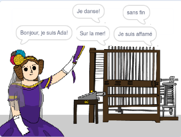

--- no-print ---

Ceci est la version **Scratch 3** du projet. Il existe également une version [Scratch 2 du projet](https://projects.raspberrypi.org/en/projects/poetry-generator-scratch2).

--- /no-print ---

## Introduction

Tu vas apprendre à programmer ton propre générateur de poésie!

--- no-print ---

  <iframe allowtransparency="true" width="485" height="402" src="https://scratch.mit.edu/projects/embed/382842799/?autostart=false" frameborder="0" scrolling="no"></iframe>
  

--- /no-print ---

--- print-only ---

--- /print-only ---

--- collapse ---
---
title: Ce que tu vas apprendre
---
+ Variables;
+ Listes et éléments de liste aléatoires;
+ Répétition (le bloc `repeat`{:class="block3control"}).

--- /collapse ---

--- collapse ---
---
title: Ce qu'il te faut
---
#### Matériel

+ Un ordinateur capable d'exécuter Scratch 3

#### Logiciel

+ Scratch 3 ([en ligne](https://rpf.io/scratchon){:target="_blank"} ou [hors ligne](https://rpf.io/scratchoff){:target="_blank"})

#### Téléchargements

Le projet de démarrage peut être trouvé [ici](https://rpf.io/p/fr-FR/poetry-generator-go){:target="_blank"}.

--- /collapse ---

--- collapse ---
---
title: Informations supplémentaires pour les éducateurs
---
Ce projet a été créé pour célébrer la [Journée d'Ada Lovelace](https://findingada.com). Si vous êtes enseignant, vous pouvez télécharger un pack de ressources scolaires contenant également un plan de montage ([Downloads.codeclub.org.uk/ada.zip](http://downloads.codeclub.org.uk/ada.zip)), pour présenter aux enfants Ada et ses idées révolutionnaires.

--- no-print ---

Si vous besoin d'imprimer ce projet, utilisez la [version imprimable.](https://projects.raspberrypi.org/fr-FR/projects/poetry-generator/print){:target="_blank"}.

--- /no-print ---

Vous pouvez trouver le [projet terminé ici](https://rpf.io/p/fr-FR/poetry-generator-get){:target="_blank"}.

--- /collapse ---
