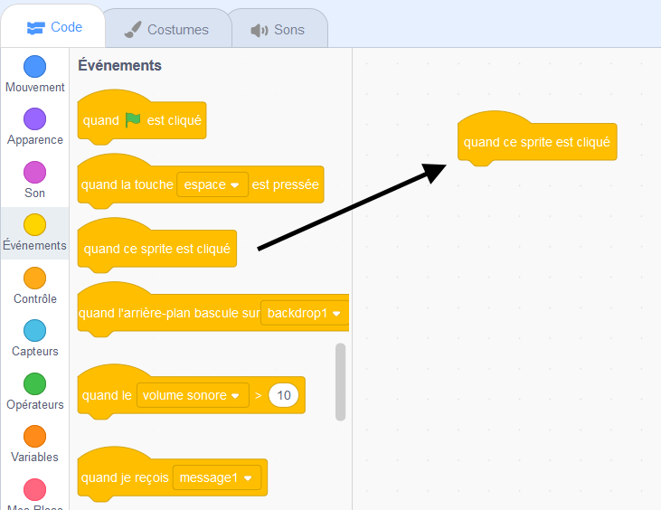
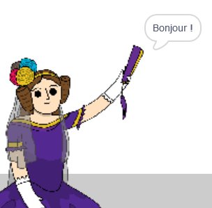

## Ada Lovelace

En 1842, Ada Lovelace a écrit sur l'utilisation d'une machine appelée « Machine Analytique » pour effectuer des calculs, et est considérée comme la première programmeuse informatique au monde ! Ada a également été la première à voir que les ordinateurs pouvaient être plus que de grandes calculatrices.

\--- task \---

Ouvre le projet de démarrage Scratch « Générateur de poésie ».

**En ligne** : ouvre le projet [starter](http://rpf.io/poetry-on){: target = "_ blank"}.

Si tu as un compte Scratch, tu peux en créer une copie en cliquant sur **Remix**.

**Hors ligne**: ouvre le [projet de démarrage](http://rpf.io/p/fr-FR/beat-the-goalie-go){:target="_blank"} dans l'éditeur hors ligne.

Si tu dois télécharger et installer l'éditeur hors-ligne Scratch, tu peux le trouver à [rpf.io/scratchoff](http://rpf.io/scratchoff){:target="_blank"}.

\--- /task \---

\--- task \---

Clique sur ton sprite « Ada », puis sur l'onglet `Evénements`{:class="block3events"} dans la section de codage « Scripts ». Fais glisser le bloc `quand ce sprite est cliqué`{:class="block3events"} dans la zone de codage à droite.




Tout code ajouté sous ce bloc s'exécutera lorsque tu cliqueras sur Ada !

\--- /task \---

\--- task \---

Clique sur l'onglet `Apparence`{:class="block3looks"}, puis fais glisser les blocs `dire`{:class="block3looks"} `Bonjour !` `pendant 2 secondes`{:class="block3looks"} sous le bloc `quand ce sprite est cliqué`{:class="block3events"} que tu as déjà ajouté.


```blocks3
when this sprite clicked
say [Hello!] for (2) seconds
```

\--- /task \---

\--- task \---

Clique sur Ada, et tu devrais la voir te parler.



\--- /task \---