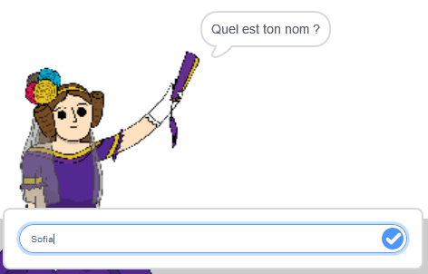
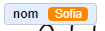
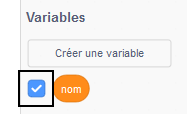
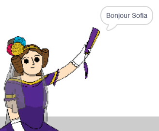

## Dire à Ada ton nom

Ada s'est présentée, mais elle ne connaît pas ton nom !

\--- task \---

Fais glisser un bloc `demander`{:class="block3sensing"} (de la section `capteurs`{:class="block3sensing"}) sur ton code. Voici à quoi ton code devrait ressembler :


```blocks3
when this sprite clicked
say [Hi, I'm Ada!] for (2) seconds
+ ask [What's your name?] and wait
```

\--- /task \---

\--- task \---

Clique sur Ada pour tester ton code. Ada devrait te demander ton nom, que tu peux taper !



\--- /task \---

\--- task \---

Nous pouvons utiliser une variable **** pour stocker ton nom. Clique sur `Variables`{:class="block3variables"}, puis sur « Créer une variable ». Comme cette variable sera utilisée pour stocker ton nom, appelons la variable ... `nom`{: class = "block3variables"} !

[[[generic-scratch3-add-variable]]]

\--- /task \---

\--- task \---

Pour stocker ton nom, clique sur l'onglet `variables`{:class="block3variables"}, puis fais glisser le bloc `mettre nom`{:class="block3variables"} à la fin de ton code.


```blocks3
when this sprite clicked
say [Hi, I'm Ada!] for (2) seconds
ask [What's your name?] and wait
+ set [name v] to [0]
```

\--- /task \---

\--- task \---

Utilise le bloc `réponse`{:class="block3sensing"} pour stocker la réponse que tu saisis.


```blocks3
when this sprite clicked
say [Hi, I'm Ada!] for (2) seconds
ask [What's your name?] and wait
set [name v] to (answer :: +)
```

\--- /task \---

\--- task \---

Clique sur Ada pour tester ton code et entre ton nom lorsque tu y es invité. Tu devrais voir que ton nom a été stocké dans la variable `nom`{:class="block3variables"}.



\--- /task \---

\--- task \---

Tu peux désormais utiliser ton nom dans ton code. Ajoute ce code :


```blocks3
when this sprite clicked
say [Hi, I'm Ada!] for (2) seconds
ask [What's your name?] and wait
set [name v] to (answer)
+say (join [Hi ] (name)) for (2) seconds 
```

Pour créer ce code :

1. Fais glisser un bloc `regrouper`{:class="blockoperators"} sur le bloc `dire`{:class="blocklooks"}
    
    ```blocks3
    say (join [apple] [banana] :: +) for (2) seconds
    ```

2. Ajoute ton bloc `nom`{:class="blockdata"} sur le bloc `regrouper`{:class="blockoperators"}.
    
    ```blocks3
    say (join [Hi] (name :: variables +)) for (2) seconds
    ```

\--- /task \---

\--- task \---

Pour masquer ta variable `nom`{:class="block3variables"} sur la scène, clique sur la coche à côté de la variable.



\--- /task \---

\--- task \---

Teste ton nouveau code. Ada devrait te dire bonjour en utilisant ton nom !



S'il n'y a pas d'espace entre le mot « Salut » et ton nom, tu dois ajouter toi-même un espace dans le code !

\--- /task \---

\--- task \---

Enfin, ajoute ce code pour expliquer ce qu'il faut faire ensuite :


```blocks3
when this sprite clicked
say [Hi, I'm Ada!] for (2) seconds
ask [What's your name?] and wait
set [name v] to (answer)
say (join [Hi ] (name)) for (2) seconds 
+ say [Click the computer to generate a poem.] for (2) seconds 
```

\--- /task \---

\--- task \---

Teste le code d'Ada une dernière fois, pour t'assurer que tout fonctionne.

\--- /task \---