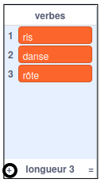
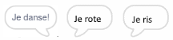

## La Machine Analytique

Programmons l'ordinateur d'Ada (appelé la « Machine Analytique ») pour générer de la poésie.

\--- task \---

Ajoute ce code à ton sprite « Ordinateur », pour qu'il parle lorsqu'il est cliqué :


```blocks3
when this sprite clicked
say [Here is your poem...] for (2) seconds
```

\--- /task \---

\--- task \---

Pour créer un poème aléatoire, tu auras besoin d'une **liste** de mots à utiliser. Pour créer une nouvelle liste, clique sur l'onglet `Variables`{:class="block3variables"}.

Utilisons **verbes** (mots d'action) dans la première ligne de ton poème. Crée une liste appelée `verbes`{:class="block3variables"}.

[[[generic-scratch3-make-list]]]

\--- /task \---

\--- task \---

Ta nouvelle liste sera vide. Clique sur le `+` en bas de ta liste vide et ajoute ces verbes :



\--- /task \---

\--- task \---

La première ligne de ton poème devrait être le mot « Je », suivi d'un verbe aléatoire.

Pour créer cette ligne de poésie, tu dois :

1. `Choisir un nombre aléatoire`{:class="block3operators"} entre `1` et la `longueur de la liste des verbes`{:class="block3variables"}:
    
    ```blocks3
    (pick random (1) to (length of [verbs v]))
    ```

2. Utiliser ce bloc pour obtenir un `élément aléatoire`{:class="block3variables"} de la liste `verbes`{:class="block3variables"} :
    
    ```blocks3
    (item (pick random (1) to (length of [verbs v]) :: +) of [verbs v])
    ```

3. `Regrouper`{:class="block3operators"} « Je » avec le verbe aléatoire pour créer la première ligne de ton poème :
    
    ```blocks3
    (join [I ] (item (pick random (1) to (length of [verbs v])) of [verbs v] :: +))
    ```

4. Utiliser un bloc `dire`{:class="block3looks"} pour afficher la ligne de la poésie :
    
    ```blocks3
    say (join [I ](item (pick random (1) to (length of [verbs v])) of [verbs v]) :: +) for (2) seconds
    ```

Ton code devrait ressembler à ceci :


```blocks3
when this sprite clicked
say [Here is your poem...] for (2) seconds
+ say (join [I ](item (pick random (1) to (length of [verbs v])) of [verbs v])) for (2) seconds
```

\--- /task \---

\--- task \---

Maintenant, teste ton code quelques fois. Ton ordinateur doit choisir un mot aléatoire dans la liste `verbes`{:class="block3variables"} à chaque fois.



\--- /task \---