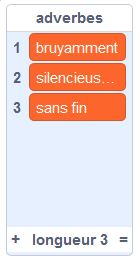
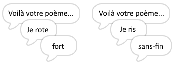
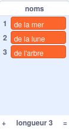
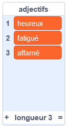
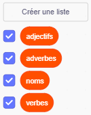

## Plus de poésie

Ton poème est plutôt court, étoffons-le !

\--- task \---

Utilisons des adverbes dans la ligne suivante de ton poème. Un **adverbe** est un mot qui décrit un verbe. Crée une autre liste appelée adverbes et ajoute ces 3 mots:



\--- /task \---

\--- task \---

Ajoute cette ligne au code de ton ordinateur, pour dire un adverbe aléatoire sur la ligne suivante de ton poème:


```blocks3
when this sprite clicked
say [Voici ton poème …] for (2) seconds
say (join [Je ](item (pick random (1) to (length of [verbes v])) of [verbes v])) for (2) seconds
+say (item (pick random (1) to (length of [adverbes v])) of [adverbes v]) for (2) seconds
```

\--- /task \---

\--- task \---

Maintenant, teste ton code plusieurs fois. Tu devrais voir un poème aléatoire à chaque fois.



\--- /task \---

\--- task \---

Ajoute une liste de noms à ton projet. Un **nom** est un lieu ou une chose.



\--- /task \---

\--- task \---

Ajoute du code pour utiliser les noms dans ton poème.


```blocks3
when this sprite clicked
say [Voici ton poème …] for (2) seconds
say (join [Je ](item (pick random (1) to (length of [verbes v])) of [verbes v])) for (2) seconds
say (item (pick random (1) to (length of [adverbes v])) of [adverbes v]) for (2) seconds
+say (join [à coté de ](item (pick random (1) to (length of [noms v])) of [noms v])) for (2) seconds
```

\--- /task \---

\--- task \---

Ajoute une liste d'adjectifs à ton projet. Un **adjectif** précise le sens d'un mot.



\--- /task \---

\--- task \---

Ajoute du code pour utiliser les adjectifs dans ton poème:


```blocks3
when this sprite clicked
say [Voici ton poème …] for (2) seconds
say (join [Je ](item (pick random (1) to (length of [verbes v])) of [verbes v])) for (2) seconds
say (item (pick random (1) to (length of [adverbes v])) of [adverbes v]) for (2) seconds
say (join [à coté de ](item (pick random (1) to (length of [noms v])) of [noms v])) for (2) seconds
+ say (join [Je me sens ](item (pick random (1) to (length of [adjectifs v])) of [adjectifs v])) for (2) seconds
```

\--- /task \---

\--- task \---

Tu peux cliquer sur les cases à côté de tes listes pour les cacher.



\--- /task \---

\--- task \---

Teste ton nouveau poème.

\--- /task \---