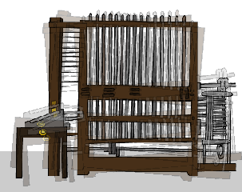

## Animons la Machine Analytique

Animons l'ordinateur, afin qu'il ait l'air de générer de la poésie.

--- task ---

Clique sur ton sprite informatique, et ajoute ce code après le premier bloc `dire`{:class="block3looks"}:

Tu trouveras les blocs `répéter`{:class="block3control"} et `attendre`{:class="block3control"} dans la section `Contrôle`{:class="block3control"}.


```blocks3
when this sprite clicked
say [Voici ton poème …] for (2) seconds
+ repeat (10)
    turn left (5) degrees
    wait (0.1) seconds
    turn right (5) degrees
    wait (0.1) seconds  
end
say (join [Je ](item (pick random (1) to (length of [verbes v])) of [verbes v])) for (2) seconds
say (item (pick random (1) to (length of [adverbes v])) of [adverbes v]) for (2) seconds
say (join [à coté de ](item (pick random (1) to (length of [noms v])) of [noms v])) for (2) seconds
say (join [Je me sens ](item (pick random (1) to (length of [adjectifs v])) of [adjectifs v])) for (2) seconds
```

--- /task ---

--- task ---

Teste ton projet. Tu devrais voir l'ordinateur trembler avant de produire un poème !



--- /task ---

--- task ---

Clique sur l’onglet « Sons » et clique sur l’icône « Choisir un son » en bas à gauche.

[[[generic-scratch3-sound-from-library]]]

--- /task ---

--- task ---

Choisis le son "computer beep" et clique sur OK.


--- /task ---

--- task ---

Ajoute un bloc `commencer le son`{:class="block3sound"}, pour jouer ton son juste avant le début de ton animation.


```blocks3
when this sprite clicked
say [Voici ton poème …] for (2) seconds
+ start sound (computer beeps1 v)
repeat (10)
    turn left (5) degrees
    wait (0.1) seconds
    turn right (5) degrees
    wait (0.1) seconds  
end
say (join [Je ](item (pick random (1) to (length of [verbes v])) of [verbes v])) for (2) seconds
say (item (pick random (1) to (length of [adverbes v])) of [adverbes v]) for (2) seconds
say (join [à coté de ](item (pick random (1) to (length of [noms v])) of [noms v])) for (2) seconds
say (join [Je me sens ](item (pick random (1) to (length of [adjectifs v])) of [adjectifs v])) for (2) seconds
```

--- /task ---