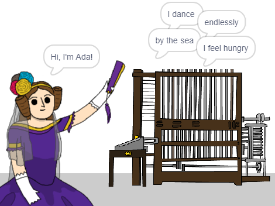

\--- no-print \---

זוהי גרסת ה- **Scratch 3** של הפרויקט. יש גם גרסת [Scratch 2 לפרויקט](https://projects.raspberrypi.org/en/projects/poetry-generator-scratch2).

\--- /no-print \---

## מבוא

אתה הולך ללמוד לתכנת מחולל שירה משלך!

\--- no-print \---

  <iframe allowtransparency="true" width="485" height="402" src="https://scratch.mit.edu/projects/embed/77844926/?autostart=false" frameborder="0" scrolling="no"></iframe>
  

\--- /no-print \---

\--- print-only \---

\--- /print-only \---

## \--- collapse \---

## title: מה תלמד

+ משתנים;
+ רשימות ופריטים ברשימה אקראית;
+ חזרות (חסימת `חזרה`{: class = "block3control"}).

\--- /collapse \---

## \--- collapse \---

## title: למה תזדקק

#### חומרה

+ מחשב המסוגל להריץ סקראטץ 3

#### תוכנה

+ Scratch 3 (או [מכוון](http://rpf.io/scratchon){:target="_blank"} or [לא מקוון](http://rpf.io/scratchoff){:target="_blank"})

#### הורדות

ניתן למצוא את פרויקט המתנע [כאן](http://rpf.io/p/en/poetry-generator-go){: target = "_ blank"}.

\--- /collapse \---

## \--- collapse \---

## title: מידע נוסף למורי המועדון

פרויקט זה נוצר כדי לחגוג [עדה לאבלייס יום](https://findingada.com). אם אתה מורה, אתה יכול להוריד חבילת משאבים לבית ספר הכוללת גם תוכנית הרכבה ([downloads.codeclub.org.uk/ada.zip](http://downloads.codeclub.org.uk/ada.zip)), כדי להכיר לילדים את עדה ואת הרעיונות המהפכניים שלה.

\--- no-print \---

אם אתה צריך להדפיס את הפרויקט הזה, אנא השתמש ב [ גרסה ידידותית למדפסת ](https://projects.raspberrypi.org/en/projects/poetry-generator/print).

\--- /no-print \---

אתה יכול למצוא את [הפרויקט השלם כאן ](http://rpf.io/p/en/poetry-generator-get) {:target="_blank"}.

\--- /collapse \---