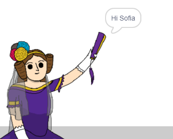

## מספרת לעדה את שמך

עדה הציגה את עצמה, אבל היא לא יודעת מה שמך!

\--- task \---

גרור חסימת `שאל`{: class = "block3sensing"} (מהקטע `sensing`{: class = "block3sensing"}) אל הקוד שלך. כך ייראה הקוד שלך:


```blocks3
when this sprite clicked
say [Hi, I'm Ada!] for (2) seconds
+ ask [What's your name?] and wait
```

\--- /task \---

\--- task \---

לחץ על עדה כדי לבדוק את הקוד שלך. עדה צריכה לשאול אותך את שמך, שתוכל להקליד!


\--- /task \---

\--- task \---

אנו יכולים להשתמש **משתנה** לאחסן את שמך. לחץ על `נתונים`{: class = "block3variables"} ואז על 'צור משתנה'. מכיוון שמשתנה זה ישמש לאחסון שמך, בוא נקרא למשתנה ... `שם`{: class = "block3variables"}!

[[[generic-scratch3-add-variable]]]

\--- /task \---

\--- task \---

כדי לאחסן את שמך, לחץ על הכרטיסייה `נתונים`{: class = "block3variables"}, ואז גרור את חסימת `הקבוצות`{: class = "block3variables"} לסוף הקוד שלך.


```blocks3
when this sprite clicked
say [Hi, I'm Ada!] for (2) seconds
ask [What's your name?] and wait
+ set [name v] to [0]
```

\--- /task \---

\--- task \---

השתמש בחסימה `תשובה`{: class = "block3sensing"} כדי לאחסן את התשובה בה אתה מקליד.


```blocks3
when this sprite clicked
say [Hi, I'm Ada!] for (2) seconds
ask [What's your name?] and wait
set [name v] to (answer :: +)
```

\--- /task \---

\--- task \---

לחץ על עדה כדי לבדוק את הקוד שלך, והזן את שמך כשנשאל. אתה צריך לראות ששמך נשמר במשתנה `שם`{: class = "block3variables"}.


\--- /task \---

\--- task \---

כעת תוכל להשתמש בשמך בקוד שלך. הוסף קוד זה:


```blocks3
when this sprite clicked
say [Hi, I'm Ada!] for (2) seconds
ask [What's your name?] and wait
set [name v] to (answer)
+say (join [Hi ] (name)) for (2) seconds 
```

ליצירת קוד זה:

1. גרור חסימת `להצטרף`{: class = "blockoperators"} אל החסימה של `אומרים`{: class = "blocklooks"}
    
    ```blocks3
    say (join [apple] [banana] :: +) for (2) seconds
    ```

2. הוסף את ה `שם`{: class = "blockdata"} לחסימה על חסימה של `join`{: class = "blockoperators"}.
    
    ```blocks3
    say (join [Hi] (name :: variables +)) for (2) seconds
    ```

\--- /task \---

\--- task \---

כדי להסתיר את המשתנה `שלך`{: class = "block3variables"} על הבמה, לחץ על הסימון לצד המשתנה.


\--- /task \---

\--- task \---

בדוק את הקוד החדש שלך. עדה צריכה להגיד לך שלום, תוך שימוש בשמך!



אם אין רווח בין המילה 'היי' לשמך, תצטרך להוסיף רווח לקוד בעצמך!

\--- /task \---

\--- task \---

לבסוף, הוסף קוד זה כדי להסביר מה לעשות הלאה:


```blocks3
when this sprite clicked
say [Hi, I'm Ada!] for (2) seconds
ask [What's your name?] and wait
set [name v] to (answer)
say (join [Hi ] (name)) for (2) seconds 
+ say [Click the computer to generate a poem.] for (2) seconds 
```

\--- /task \---

\--- task \---

בדוק את הקוד של עדה בפעם האחרונה, כדי לוודא שהכל עובד.

\--- /task \---