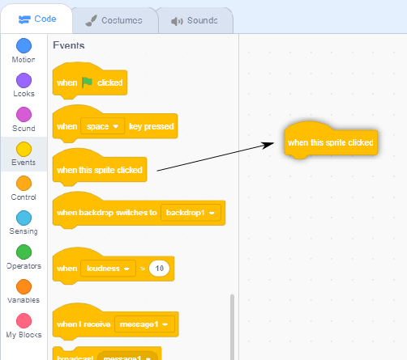

## अदा लवलेस

1842 में, अदा लवलेस ने गणना करने के लिए 'एनालिटिकल यन्त्र' नामक मशीन का उपयोग करने के बारे में लिखा, और इसे अब दुनिया के पहले कंप्यूटर प्रोग्रामर के रूप में देखा जाता है! अदा दुनिया में उन चुनिंदा लोगो में से है जिन्होंने यह समझा की कंप्यूटर केवल बड़े कैलकुलेटर जितना नहीं उससे ऊपर बहुत कुछ कर सकता है |

\--- task \---

कविता जनरेटर स्टार्टर प्रोजेक्ट को खोले |

**ऑनलाइन**: [स्टार्टर प्रोजेक्ट खोलें](https://rpf.io/poetry-on){:target="_blank"}।

यदि आपके पास एक Scratch खाता है, तो आप **Remix** पर क्लिक करके कॉपी बना सकते हैं ।

**ऑफलाइन**: [स्टार्टर प्रोजेक्ट](https://rpf.io/p/hi-IN/poetry-generator-go){:target="_blank"} को ऑफलाइन एडिटर में खोलिये।

यदि आपको Scratch ऑफ़लाइन संपादक को डाउनलोड और इंस्टॉल करना चाहते है, तो आप इसे [rpf.io/scratchoff](https://rpf.io/scratchoff){:target="_blank"} पर पा सकते हैं।

\--- /task \---

\--- task \---

अपने 'अदा' के स्प्राइट पे क्लिक करें, और 'Scripts' कोडिंग खाने से `Events`{:class="block3events"} बटन पर क्लिक करें। `when this sprite clicked`{:class="block3events"} वाले ब्लॉक को दाईं ओर कोडिंग क्षेत्र पर लाकर खींचे |




इस ब्लॉक के नीचे जोड़ा गया कोई भी कोड तभी चलेगा जब अदा पर क्लिक किया जाएगा!

\--- /task \---

\--- task \---

आप `Looks`{:class="block3looks"} बटन को क्लिक करें, और `say`{:class="block3looks"} `Hello!` `for 2 secs`{:class="block3looks"} वाले ब्लॉक को `when this sprite clicked`{:class="block3events"} ब्लॉक के नीचे खींचकर छोड़ दीजिये |


```blocks3
when this sprite clicked
say [Hello!] for (2) seconds
```

\--- /task \---

\--- task \---

अदा पर क्लिक करें, और अब वो आपसे बात करते हुए नज़र आनी चाहिए |


\--- /task \---