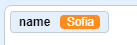
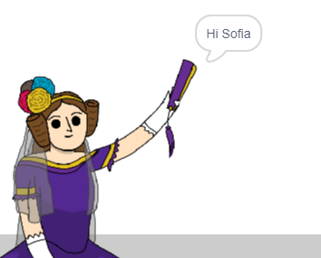

## अदा को अपना नाम बताना

अदा ने अपना परिचय दिया है, लेकिन वह आपका नाम नहीं जानती है!

\--- task \---

अब आप ` ask `{:class="block3sensing"} ब्लॉक (यहाँ से `sensing`{:class="block3sensing"}) अपने कोड पर खींचें | आपका कोड ऐसा दिखना चाहिए:


```blocks3
when this sprite clicked
say [Hi, I'm Ada!] for (2) seconds
+ ask [What's your name?] and wait
```

\--- /task \---

\--- task \---

अदा के स्प्राइट पर क्लिक करके अपना कोड टेस्ट करें | अदा कोआपसे आपका नाम पूछना चाहिए, जिसे आप टाइप कर सकते हैं!


\--- /task \---

\--- task \---

हम आपका नाम संग्रहित करने के लिए **variable** का उपयोग कर सकते हैं | `Data`{:class="block3variables"} पर क्लिक करें, और फिर 'Make a Variable' पर क्लिक करें | क्योंकि ये variable आपके नाम को संग्रहीत करने के लिए प्रयोग होगा, चलिए इस variable का नाम हम रखते है... `name`{:class="block3variables"}!

[[[generic-scratch3-add-variable]]]

\--- /task \---

\--- task \---

अपना नाम संग्रहित करने के लिए, `Data`{:class="block3variables"} बटन को क्लिक करें और फिर `set name`{:class="block3variables"} ब्लॉक को खींच कर अपने कोड के अंत पे लाकर चिपका दीजिये |


```blocks3
when this sprite clicked
say [Hi, I'm Ada!] for (2) seconds
ask [What's your name?] and wait
+ set [name v] to [0]
```

\--- /task \---

\--- task \---

अपने उत्तर को स्टोर करने के लिए, `answer`{:class="block3sensing"} ब्लॉक का उपयोग करें |


```blocks3
when this sprite clicked
say [Hi, I'm Ada!] for (2) seconds
ask [What's your name?] and wait
set [name v] to (answer :: +)
```

\--- /task \---

\--- task \---

अपने कोड का परीक्षण करने के लिए अदा के स्प्राइट पर क्लिक करें, और पूछे जाने पर अपना नाम दर्ज करें। अब आपको आपके द्वारा दर्ज़ किया गया नाम `name`{:class="block3variables"} variable में संग्रहित दिखना चाहिए |



\--- /task \---

\--- task \---

अब आप अपने कोड में अपने नाम का उपयोग कर सकते हैं। इस कोड को जोड़ें:


```blocks3
when this sprite clicked
say [Hi, I'm Ada!] for (2) seconds
ask [What's your name?] and wait
set [name v] to (answer)
+say (join [Hi ] (name)) for (2) seconds 
```

इस कोड को बनाने के लिए:

1. `join`{:class="blockoperators"} ब्लॉक को `say`{:class="blocklooks"} ब्लॉक के ऊपर खींचे
    
    ```blocks3
    say (join [apple] [banana] :: +) for (2) seconds
    ```

2. अपने `name`{:class="blockdata"} ब्लॉक को `join`{:class="blockoperators"} ब्लॉक के ऊपर जोड़े |
    
    ```blocks3
    say (join [Hi] (name :: variables +)) for (2) seconds
    ```

\--- /task \---

\--- task \---

अपने `name`{:class="block3variables"} variable को स्टेज पर छुपाने के लिए, variable के पास बने हुए खांचे में क्लिक करके सही का निशान बनाये |


\--- /task \---

\--- task \---

अपने नए कोड का परीक्षण करें। अब अदा आपको आपके नाम से हेलो बोलेंगी!



अगर आपके नाम और 'Hi' के बीच में कोई जगह नहीं है तो वो आपको खुद से अपने कोड में ठीक करना होगा |

\--- /task \---

\--- task \---

अंत में, आगे क्या करना है, यह समझाने के लिए इस कोड को जोड़ें:


```blocks3
when this sprite clicked
say [Hi, I'm Ada!] for (2) seconds
ask [What's your name?] and wait
set [name v] to (answer)
say (join [Hi ] (name)) for (2) seconds 
+ say [Click the computer to generate a poem.] for (2) seconds 
```

\--- /task \---

\--- task \---

यह सुनिश्चित करने के लिए कि सब कुछ काम कर रहा है, अदा के कोड को अंतिम बार परिक्षण करें।

\--- /task \---