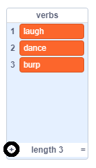
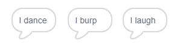

## एनालिटिकल यन्त्र

आइए कविता को बनाने के लिए अदा के कंप्यूटर (जिनको 'एनालिटिकल यन्त्र' कहा जाता है) को प्रोग्राम करें।

\--- task \---

इस कोड को अपने 'कंप्यूटर' स्प्राइट में जोड़ें, ताकि क्लिक करने पर यह बोलें:


```blocks3
when this sprite clicked
say [Here is your poem...] for (2) seconds
```

\--- /task \---

\--- task \---

एक अनोखी कविता बनाने के लिए, पहले आपको शब्दों कि **सूची** की आवश्यक्ता होगी | एक नई सूची बनाने के लिए, `Data`{:class="block3variables"} बटन पर क्लिक करें।

चलिए, आपके कविता के पहले पंक्ति में हम उपयोग करेंगे **क्रिया** (कार्य दर्शाने वाले शब्द) `verbs`{:class="block3variables"} नामक एक नयी सूची तैयार करें |

[[[generic-scratch3-make-list]]]

\--- /task \---

\--- task \---

आपकी नई सूची फिलहाल खाली होगी। अपने खाली लिस्ट के नीचे ये `+` पर क्लिक करें और इन क्रियाओं को जोड़ें:



\--- /task \---

\--- task \---

आपके कविता की पहली पंक्ति का शब्द "I" ही होना चाहिए, जिसके बाद आप कोई भी क्रिया शब्द का उपयोग कर सकते है |

कविता की इस पंक्ति को बनाने के लिए, आपको ये करना होगा:

1. `Pick a random number`{:class="block3operators"} पर क्लिक करें, `1`और `length of the verbs list`{:class="block3variables"} को ऐसे सजाये:
    
    ```blocks3
    (pick random (1) to (length of [verbs v]))
    ```

2. `item`{:class="block3variables"} ब्लॉक का उपयोग करें ताकि आपको `verbs`{:class="block3variables"} सूची से एक अनोखा आइटम मिले:
    
    ```blocks3
    (item (pick random (1) to (length of [verbs v]) :: +) of [verbs v])
    ```

3. अपने कविता की पहली पंक्ति बनाने के लिए, "I" शब्द को `Join`{:class="block3operators"} करें उस अनोखे क्रिया से:
    
    ```blocks3
    (join [I ] (item (pick random (1) to (length of [verbs v])) of [verbs v] :: +))
    ```

4. अपनी कविता के पंक्तियों को दिखाने के लिए, `say`{:class="block3looks"} ब्लॉक का उपयोग करें:
    
    ```blocks3
    say (join [I ](item (pick random (1) to (length of [verbs v])) of [verbs v]) :: +) for (2) seconds
    ```

आपका कोड इस प्रकार दिखना चाहिए:


```blocks3
when this sprite clicked
say [Here is your poem...] for (2) seconds
+ say (join [I ](item (pick random (1) to (length of [verbs v])) of [verbs v])) for (2) seconds
```

\--- /task \---

\--- task \---

अपने कोड का कुछ समय परीक्षण करें। आपका कंप्यूटर हर बार `verbs`{:class="block3variables"} सूची से एक अनोखा शब्द चुनना चाहिए |



\--- /task \---