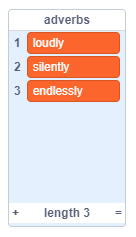
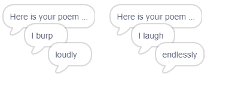
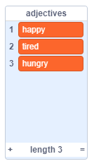

## और कविताएँ

आपकी कविता काफी छोटी है - आइए इसे और बड़ा बनाते है!

\--- task \---

चलिए आपके कविता की अगली पंक्ति में क्रिया विशेषणों (adverbs) का उपयोग करें। एक **क्रिया विशेषण (adverb)** ऐसा शब्द है जो किसी क्रिया (verb) का वर्णन करता है। क्रिया विशेषण नामक एक और सूची बनाएं, और इन 3 शब्दों को जोड़ें:



\--- /task \---

\--- task \---

इस पंक्ति को अपने कंप्यूटर के कोड में जोड़ें, अपनी कविता की अगली पंक्ति पर एक अनोखी क्रिया विशेषण कहने के लिए:


```blocks3
when this sprite clicked
say [Here is your poem...] for (2) seconds
say (join [I ](item (pick random (1) to (length of [verbs v])) of [verbs v])) for (2) seconds
+say (item (pick random (1) to (length of [adverbs v])) of [adverbs v]) for (2) seconds
```

\--- /task \---

\--- task \---

अपने कोड का कुछ समय परीक्षण करें। आपको हर बार एक अनोखी कविता दिखनी चाहिए।



\--- /task \---

\--- task \---

अपने प्रोजेक्ट में संज्ञा (nouns) की एक सूची जोड़ें। **संज्ञा (noun)** एक जगह या एक चीज होती है।


\--- /task \---

\--- task \---

अपनी कविता में संज्ञाओं (nouns) का उपयोग करने के लिए कोड जोड़ें।


```blocks3
when this sprite clicked
say [Here is your poem...] for (2) seconds
say (join [I ](item (pick random (1) to (length of [verbs v])) of [verbs v])) for (2) seconds
say (item (pick random (1) to (length of [adverbs v])) of [adverbs v]) for (2) seconds
+say (join [by the ](item (pick random (1) to (length of [nouns v])) of [nouns v])) for (2) seconds
```

\--- /task \---

\--- task \---

अपने प्रोजेक्ट में विशेषणों (adjectives) की एक सूची जोड़ें। एक **विशेषण (adjective)** वर्णनात्मक शब्द होते हैं।



\--- /task \---

\--- task \---

अपनी कविता में विशेषणों (adjectives) का उपयोग करने के लिए कोड जोड़ें:


```blocks3
when this sprite clicked
say [Here is your poem...] for (2) seconds
say (join [I ](item (pick random (1) to (length of [verbs v])) of [verbs v])) for (2) seconds
say (item (pick random (1) to (length of [adverbs v])) of [adverbs v]) for (2) seconds
say (join [by the ](item (pick random (1) to (length of [nouns v])) of [nouns v])) for (2) seconds
+ say (join [I feel ](item (pick random (1) to (length of [adjectives v])) of [adjectives v])) for (2) seconds
```

\--- /task \---

\--- task \---

आप उन्हें छिपाने के लिए अपनी सूचियों के बगल में स्थित बक्सों पर क्लिक कर सकते हैं।


\--- /task \---

\--- task \---

अपनी नई कविता का परीक्षण करें।

\--- /task \---