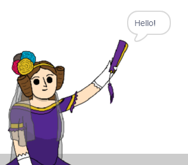

## Ada Lovelace

Godine 1842. Ada Lovelace pisala je o korištenju stroja nazvanog "Analitički motor" za izračun, a smatra se prvim računalnim programerom na svijetu! Ada je također prva vidjela da računala mogu biti i više nego samo veliki kalkulatori.

\--- task \---

Otvorite početni projekt „Generator poezije“.

**Online**: open the [starter project](https://rpf.io/poetry-on){:target="_blank"}.

Ako imate Scratch račun, možete napraviti kopiju klikom na ** Remix **.

**Offline**: open the [starter project](https://rpf.io/p/en/poetry-generator-go){:target="_blank"} in the offline editor.

If you need to download and install the Scratch offline editor, you can find it at [rpf.io/scratchoff](https://rpf.io/scratchoff){:target="_blank"}.

\--- /task \---

\--- task \---

Kliknite svoj 'Ada' sprite i kliknite karticu `Događaji`{: class = "block3events"} u odjeljku za kodiranje 'Skripte'. Povucite `kada je ovaj sprite kliknuo`{: class = "block3events"} blok na područje kodiranja s desne strane.


Svaka koda dodana ispod ovog bloka pokrenut će se kad se klikne Ada!

\--- /task \---

\--- task \---

Kliknite karticu `Izgleda`{: class = "block3looks"} i povucite `recimo`{: class = "block3looks"} `Pozdrav!` `trajanju od 2 sekunde`{: class = "block3looks"} blok ispod `kada je ovaj sprite kliknuo`{: class = "block3events"} blok koji ste već dodali.


```blocks3
when this sprite clicked
say [Hello!] for (2) seconds
```

\--- /task \---

\--- task \---

Kliknite na Adu i trebali biste je vidjeti kako razgovara s vama.



\--- /task \---