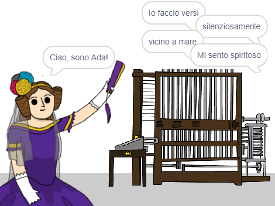

--- no-print ---

Questa è la versione **Scratch 3** del progetto. C'è anche una versione [Scratch 2 del progetto](https://projects.raspberrypi.org/en/projects/poetry-generator-scratch2).

--- /no-print ---

## Introduzione

Imparerai come programmare il tuo generatore di poesie!

--- no-print ---

  <iframe allowtransparency="true" width="485" height="402" src="https://scratch.mit.edu/projects/embed/382370657/?autostart=false" frameborder="0" scrolling="no"></iframe>
  

--- /no-print ---

--- print-only ---

--- /print-only ---

--- collapse ---
---
title: Cosa imparerai
---
+ Variabili;
+ Liste ed elementi casuali della lista;
+ Ripetizione (il blocco `ripeti`{:class="block3control"}).

--- /collapse ---

--- collapse ---
---
title: Cosa ti serve
---
#### Hardware

+ Un computer in grado di eseguire Scratch 3

#### Software

+ Scratch 3 ([online](https://rpf.io/scratchon){:target="_blank"} o [offline](https://rpf.io/scratchoff){:target="_blank"})

#### Download

Il progetto per principianti si trova [qui](https://rpf.io/p/it-IT/poetry-generator-go){:target="_ blank"}.

--- /collapse ---

--- collapse ---
---
title: Informazioni aggiuntive per gli educatori
---
Questo progetto è stato creato per celebrare la [Giornata di Ada Lovelace](https://findingada.com). Se sei un insegnante, puoi scaricare un pacchetto di risorse per la scuola che contiene anche un piano di attività ([downloads.codeclub.org.uk/ada.zip](http://downloads.codeclub.org.uk/ada.zip)) per presentare ai bambini Ada e le sue idee rivoluzionarie.

--- no-print ---

Se hai bisogno di stampare questo progetto, usa la [versione stampabile](https://projects.raspberrypi.org/it-IT/projects/poetry-generator/print){:target="_blank"}.

--- /no-print ---

Puoi trovare il [progetto completo qui](https://rpf.io/p/it-IT/poetry-generator-get){:target="_blank"}.

--- /collapse ---
