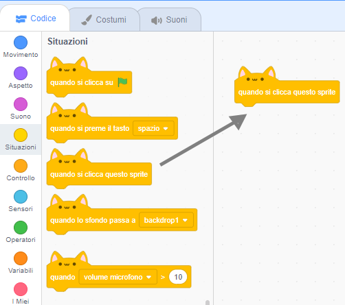
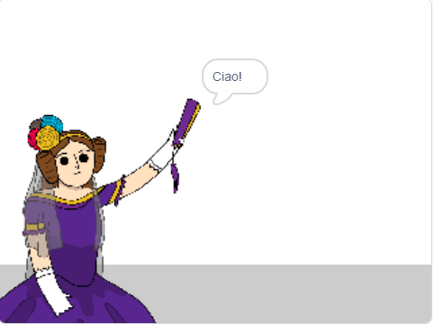

## Ada Lovelace

Nel 1842, Ada Lovelace scrisse a proposito dell'uso di una macchina chiamata "Motore Analitico" per fare calcoli ed è riconosciuta come il primo programmatore di computer al mondo! Ada è stata anche la prima a capire che i computer potevano essere più che semplici calcolatori.

\--- task \---

Apri il progetto di avvio Scratch 'Generatore di Poesie'.

**Online**: apri il [progetto per principianti](https://scratch.mit.edu/projects/382370095){:target="_blank"}.

Se hai un account su Scratch, puoi farne una copia facendo clic su **Remix**.

**Offline:** apri il [progetto per principianti](https://rpf.io/p/it-IT/beat-the-goalie-go){:target="_blank"} nell'editor offline.

Se hai bisogno di scaricare ed installare l'editor Scratch offline, puoi trovarlo su [rpf.io/scratchoff](https://rpf.io/scratchoff){:target="_blank"}.

\--- /task \---

\--- task \---

Fai clic sullo sprite "Ada" e fai clic sulla scheda `Eventi`{:class="block3events"} nella sezione di codifica "Codice". Trascina il blocco `quando si clicca su questo sprite`{:class="block3events"} nell'area di codifica sulla destra.




Qualsiasi codice aggiunto sotto questo blocco verrà eseguito quando si fa clic su Ada!

\--- /task \---

\--- task \---

Fare clic sulla scheda `Aspetto`{:class="block3looks"} e trascinare il blocco `dire`{:class="block3looks"} `Ciao!` `per 2 secondi`{:class="block3looks"} sotto al blocco `quando si clicca su questo sprite`{:class="block3events"} che hai già aggiunto.


```blocks3
when this sprite clicked
say [Hello!] for (2) seconds
```

\--- /task \---

\--- task \---

Fai clic su Ada e dovresti vederla parlare con te.



\--- /task \---