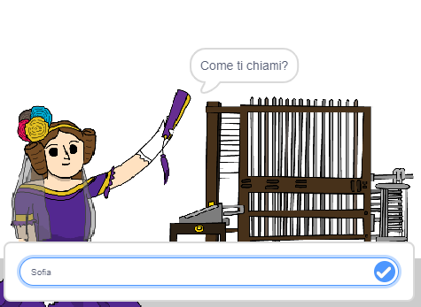

## Dire ad Ada il tuo nome

Ada si è presentata, ma non conosce il tuo nome!

\--- task \---

Trascina un blocco `chiedi`{:class="block3sensing"} (dalla sezione `sensori`{:class="block3sensing"}) nel tuo codice. Il tuo codice dovrebbe essere più o meno così:


```blocks3
when this sprite clicked
say [Hi, I'm Ada!] for (2) seconds
+ ask [What's your name?] and wait
```

\--- /task \---

\--- task \---

Fai clic su Ada per testare il tuo codice. Ada dovrebbe chiederti il tuo nome, che puoi digitare!



\--- /task \---

\--- task \---

Possiamo usare una **variabile** per memorizzare il tuo nome. Fai clic su `Variabili`{:class="block3variables"}, quindi su "Crea una Variabile". Poiché questa variabile verrà utilizzata per memorizzare il tuo nome, chiamiamo la variabile... `nome`{:class="block3variables"}!

[[[generic-scratch3-add-variable]]]

\--- /task \---

\--- task \---

Per memorizzare il tuo nome, fai clic sulla scheda `Variabili`{:class="block3variables"}, quindi trascina il blocco `imposta nome`{:class="block3variables"} alla fine del codice.


```blocks3
when this sprite clicked
say [Hi, I'm Ada!] for (2) seconds
ask [What's your name?] and wait
+ set [name v] to [0]
```

\--- /task \---

\--- task \---

Usa il blocco `risposta`{:class="block3sensing"} per memorizzare la risposta digitata.


```blocks3
when this sprite clicked
say [Hi, I'm Ada!] for (2) seconds
ask [What's your name?] and wait
set [name v] to (answer :: +)
```

\--- /task \---

\--- task \---

Fai clic su Ada per testare il tuo codice e inserisci il tuo nome quando richiesto. Dovresti vedere che il tuo nome è stato memorizzato nella variabile `nome`{:class="block3variables"}.


\--- /task \---

\--- task \---

Ora puoi usare il tuo nome nel tuo codice. Aggiungi questo codice:


```blocks3
when this sprite clicked
say [Hi, I'm Ada!] for (2) seconds
ask [What's your name?] and wait
set [name v] to (answer)
+say (join [Hi ] (name)) for (2) seconds 
```

Per creare questo codice:

1. Trascina un blocco `unione`{:class="blockoperators"} nel blocco `dire`{:class="blocklooks"}
    
    ```blocks3
    say (join [apple] [banana] :: +) for (2) seconds
    ```

2. Aggiungi il tuo blocco `nome`{:class="blockdata"} nel blocco `unione`{:class="blockoperators"}.
    
    ```blocks3
    say (join [Hi] (name :: variables +)) for (2) seconds
    ```

\--- /task \---

\--- task \---

Per nascondere la variabile `nome`{:class="block3variables"} dallo stage, fai clic sul segno di spunta accanto alla variabile.


\--- /task \---

\--- task \---

Prova il tuo nuovo codice. Ada dovrebbe salutarti, usando il tuo nome!


Se non c'è spazio tra la parola "Ciao" e il tuo nome, dovrai aggiungere tu uno spazio nel codice!

\--- /task \---

\--- task \---

Infine, aggiungi questo codice per spiegare cosa fare dopo:


```blocks3
when this sprite clicked
say [Hi, I'm Ada!] for (2) seconds
ask [What's your name?] and wait
set [name v] to (answer)
say (join [Hi ] (name)) for (2) seconds 
+ say [Click the computer to generate a poem.] for (2) seconds 
```

\--- /task \---

\--- task \---

Prova il codice di Ada un'ultima volta, per assicurarti che tutto funzioni.

\--- /task \---