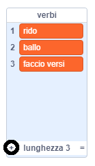
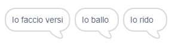

## Il Motore Analitico

Programmiamo il computer di Ada (chiamato 'Motore Analitico') per generare poesia.

\--- task \---

Aggiungi questo codice allo sprite 'Computer', in modo che parli quando fai clic:


```blocks3
when this sprite clicked
say [Here is your poem...] for (2) seconds
```

\--- /task \---

\--- task \---

Per creare una poesia casuale, per prima cosa avrai bisogno di una **lista** di parole da usare. Per creare una nuova lista, fai clic sulla scheda `Variabili`{:class="block3variables"}.

Usiamo dei **verbi** (parole d'azione) nella prima riga della tua poesia. Crea una nuova lista chiamata `verbi`{:class="block3variables"}.

[[[generic-scratch3-make-list]]]

\--- /task \---

\--- task \---

La tua nuova lista sarà vuota. Fai clic su `+` nella parte inferiore della tua lista vuota e aggiungi questi verbi:



\--- /task \---

\--- task \---

La prima riga della tua poesia dovrebbe essere la parola "Io", seguita da un verbo a caso.

Per creare questa riga di poesia, devi fare così:

1. Scegli un `numero a caso`{:class="block3operators"} tra `1` e la `lunghezza della lista verbi`{:class="block3variables"}:
    
    ```blocks3
    (pick random (1) to (length of [verbs v]))
    ```

2. Usa questo blocco per ottenere un `elemento`{:class="block3variables"} a caso dalla lista `verbi`{:class="block3variables"}:
    
    ```blocks3
    (item (pick random (1) to (length of [verbs v]) :: +) of [verbs v])
    ```

3. `Unisci`{:class="block3operators"} "Io " con il verbo scelto a caso per creare la prima riga della tua poesia:
    
    ```blocks3
    (join [I ] (item (pick random (1) to (length of [verbs v])) of [verbs v] :: +))
    ```

4. Usa un blocco `dire`{:class="block3looks"} per visualizzare la riga della poesia:
    
    ```blocks3
    say (join [I ](item (pick random (1) to (length of [verbs v])) of [verbs v]) :: +) for (2) seconds
    ```

Il tuo codice dovrebbe apparire così:


```blocks3
quando si clicca su questo sprite
dire [Ecco la tua poesia...] per (2) secondi
+ dire (unione [Io ] e (elemento (numero a caso tra (1) e (lunghezza di [verbi v])) di [verbi v])) per (2) secondi
```

\--- /task \---

\--- task \---

Ora prova il tuo codice qualche volta. Il tuo computer dovrebbe scegliere ogni volta una parola a caso dalla lista `verbi`{:class="block3variables"}.



\--- /task \---