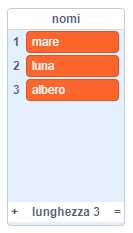

## Altra poesia

La tua poesia è piuttosto breve - allunghiamola!

--- task ---

Usiamo gli avverbi nella riga successiva della tua poesia. Un **avverbio** è una parola che descrive un verbo. Crea un'altra lista chiamata avverbi, e aggiungi queste 3 parole:


--- /task ---

--- task ---

Aggiungi questa riga al codice del tuo computer, per dire un avverbio casuale nella riga successiva della tua poesia:


```blocks3
when this sprite clicked
say [Ecco la tua poesia…] for (2) seconds
say (join [I ](item (pick random (1) to (length of [verbi v])) of [verbi v])) for (2) seconds
+say (item (pick random (1) to (length of [avverbi v])) of [avverbi v]) for (2) seconds
```

--- /task ---

--- task ---

Prova il tuo codice alcune volte. Dovresti vedere una poesia casuale ogni volta.


--- /task ---

--- task ---

Aggiungi una lista di nomi al tuo progetto. Un **nome** è un posto o una cosa.



--- /task ---

--- task ---

Aggiungi il codice per usare i nomi nella tua poesia.


```blocks3
when this sprite clicked
say [Ecco la tua poesia…] for (2) seconds
say (join [I ](item (pick random (1) to (length of [verbi v])) of [verbi v])) for (2) seconds
say (item (pick random (1) to (length of [avverbi v])) of [avverbi v]) for (2) seconds
+say (join [by the ](item (pick random (1) to (length of [nomi v])) of [nomi v])) for (2) seconds
```

--- /task ---

--- task ---

Aggiungi una lista di aggettivi al tuo progetto. Un **aggettivo** è una parola che descrive.


--- /task ---

--- task ---

Aggiungi il codice per usare gli aggettivi nella tua poesia:


```blocks3
when this sprite clicked
say [Ecco la tua poesia…] for (2) seconds
say (join [I ](item (pick random (1) to (length of [verbi v])) of [verbi v])) for (2) seconds
say (item (pick random (1) to (length of [avverbi v])) of [avverbi v]) for (2) seconds
say (join [by the ](item (pick random (1) to (length of [nomi v])) of [nomi v])) for (2) seconds
+ say (join [I feel ](item (pick random (1) to (length of [aggettivi v])) of [aggettivi v])) for (2) seconds
```

--- /task ---

--- task ---

Puoi fare clic sulle caselle accanto alle tue liste per nasconderle.


--- /task ---

--- task ---

Prova la tua nuova poesia.

--- /task ---