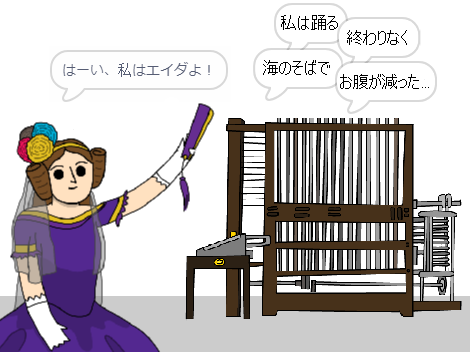

\--- no-print \---

これは**Scratch 3**用のプロジェクトです。 [Scratch 2用のプロジェクト](https://projects.raspberrypi.org/en/projects/poetry-generator-scratch2)もあります。

\--- /no-print \---

## はじめに

自分用の自動作詩機のプログラム方法を学びます！

\--- no-print \---

  <iframe allowtransparency="true" width="485" height="402" src="https://scratch.mit.edu/projects/embed/77844926/?autostart=false" frameborder="0" scrolling="no"></iframe>
  

\--- /no-print \---

\--- print-only \---

\--- /print-only \---

## \--- collapse \---

## title: 学習すること

+ 変数
+ リストとランダムなリストアイテム。
+ 繰り返し (`繰り返し`{:class="block3control"}ブロック)。

\--- /collapse \---

## \--- collapse \---

## title: 必要なもの

#### ハードウェア

+ Scratch 3を実行できるコンピュータ

#### ソフトウェア

+ Scratch 3 ([オンライン](https://rpf.io/scratchon){:target="_blank"}または[オフライン](https://rpf.io/scratchoff){:target="_blank"})

#### ダウンロードするもの

基本(きほん)のプロジェクトは [こちら](https://rpf.io/p/ja-JP/poetry-generator-go){:target="_blank"}にあります。

\--- /collapse \---

## \--- collapse \---

## title: 教育者向けの追加情報

このプロジェクトは、 [エイダ・ラブレースの日](https://findingada.com)を祝うために作成されました。 If you're a teacher, you can download a School Resource Pack which also contains an assembly plan ([downloads.codeclub.org.uk/ada.zip](https://downloads.codeclub.org.uk/ada.zip)), to introduce children to Ada and her revolutionary ideas.

\--- no-print \---

このプロジェクトを印刷する必要がある場合は、 [印刷用バージョン](https://projects.raspberrypi.org/en/projects/poetry-generator/print){:target="_ blank"}を使用してください。

\--- /no-print \---

[完成したプロジェクトはこちらに](https://rpf.io/p/ja-JP/poetry-generator-get){:target="_blank"}あります 。

\--- /collapse \---