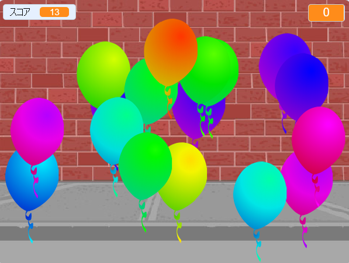

## 次は何をしましょうか？

[バルーン](https://projects.raspberrypi.org/en/projects/balloons)Scratchプロジェクトを見てください。

--- no-print ---

バルーンをクリックして割っていきます。

  <iframe allowtransparency="true" width="485" height="402" src="https://scratch.mit.edu/projects/embed/299206746/?autostart=false" frameborder="0" scrolling="no"></iframe>
  

--- /no-print ---

--- print-only ---

--- /print-only ---

***

このプロジェクトは以下のボランティアによって翻訳されました。

大野 雅利
Misato Kano

ボランティアのおかげで、世界中の人々に母国語で学ぶ機会を与えることができます。翻訳を引き受けていただくことで、より多くの人々に手を差し伸べることができます。詳しくは [rpf.io/translate](https://rpf.io/translate) をご覧ください。