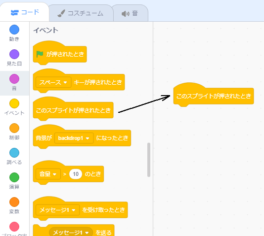
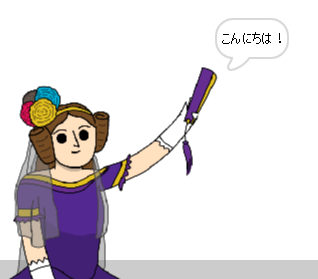

## エイダ・ラブレース

1842年、エイダ・ラブレースは「解析機関(アナリティカルエンジン)」と呼ばれる装置を使用して計算を行うことについて書物を書き、世界初のコンピュータプログラマーと見なされています。 エイダはまた、コンピュータが単なる大きな計算機以上のもとなる可能性があることを見抜いた最初の人でした。

\--- task \---

「自動作詩機」のScratchスタータープロジェクトを開きます。

**オンライン**： [スタータープロジェクト](http://rpf.io/poetry-on){:target="_ blank"}を開きます。

Scratchのアカウントをお持ちの場合は**リミックス**をクリックしてコピーを作成できます。

**オフライン**: オフラインエディタで[スタータープロジェクト](http://rpf.io/p/en/beat-the-goalie-go){:target="_blank"}を開きます。

Scratchオフラインエディタをダウンロードしてインストールする必要がある場合は、[rpf.io/scratchoff](http://rpf.io/scratchoff){:target="_blank"}にあります。

\--- /task \---

\--- task \---

「Ada」スプライトをクリックし、「スクリプト」のコーディングセクションにある `イベント`{:class="block3events"}タブをクリックします。 `このスプライトが押されたとき`{:class="block3events"}ブロックを、右側のコーディングエリアにドラッグします。




Any code added underneath this block will run when Ada is clicked!

\--- /task \---

\--- task \---

Click the `Looks`{:class="block3looks"} tab, and drag the `say`{:class="block3looks"} `Hello!` `for 2 secs`{:class="block3looks"} block underneath the `when this sprite clicked`{:class="block3events"} block you've already added.


```blocks3
when this sprite clicked
say [Hello!] for (2) seconds
```

\--- /task \---

\--- task \---

Click on Ada, and you should see her talk to you.



\--- /task \---