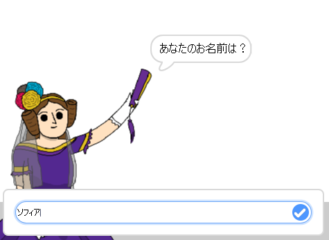
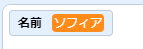
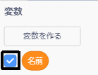
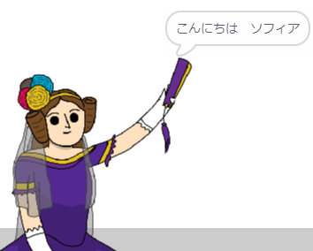

## エイダにあなたの名前を伝える

エイダは自己紹介しましたが、彼女はあなたの名前を知りません！

\--- task \---

`と聞いて待つ`{:class="block3sensing"}ブロックを(`調べる`{:class="block3sensing"}セクションから)作成中のコードにドラッグします。 コードは次のようになります。


```blocks3
when this sprite clicked
say [Hi, I'm Ada!] for (2) seconds
+ ask [What's your name?] and wait
```

\--- /task \---

\--- task \---

エイダをクリックしてコードをテストします。 エイダはあなたの名前を聞いてきます。そしてあなたは名前をキーボードから入力できます！



\--- /task \---

\--- task \---

**変数** を使用すればあなたの名前を保存できます。 `変数`{:class="block3variables"}をクリックし、次に「変数を作る」をクリックします。 この変数はあなたの名前を保存するために使用されるので、変数名は... `名前`{:class="block3variables"}にしましょう！

[[[generic-scratch3-add-variable]]]

\--- /task \---

\--- task \---

名前を保存するには、`変数`{:class="block3variables"}タブをクリックし、 `名前を(0)にする`{:class="block3variables"}ブロックをコードの最後にドラッグします。


```blocks3
when this sprite clicked
say [Hi, I'm Ada!] for (2) seconds
ask [What's your name?] and wait
+ set [name v] to [0]
```

\--- /task \---

\--- task \---

入力した内容を保存するには、`答え`{:class="block3sensing"}ブロックを使います。


```blocks3
when this sprite clicked
say [Hi, I'm Ada!] for (2) seconds
ask [What's your name?] and wait
set [name v] to (answer :: +)
```

\--- /task \---

\--- task \---

エイダをクリックして、問いかけられたらあなたの名前を入力し、コードをテストします。 あなたの名前が`名前`{:class="block3variables"}変数に保存されたことがわかります。



\--- /task \---

\--- task \---

これで、あなたの名前がコードで使えるようになりました。 このコードを追加します。


```blocks3
when this sprite clicked
say [Hi, I'm Ada!] for (2) seconds
ask [What's your name?] and wait
set [name v] to (answer)
+say (join [Hi ] (name)) for (2) seconds 
```

このコードを作るには：

1. `(apple)と(bananna)`{:class="blockoperators"}ブロックを `(こんにちは！)と(2)秒言う`{:class="blocklooks"}ブロックにドラッグします
    
    ```blocks3
    say (join [apple] [banana] :: +) for (2) seconds
    ```

2. `名前`{:class="blockdata"}ブロックを `(apple)と(bananna)`{:class="blockoperators"}ブロックに追加します。
    
    ```blocks3
    say (join [Hi] (name :: variables +)) for (2) seconds
    ```

\--- /task \---

\--- task \---

`名前`{:class="block3variables"}変数をステージに表示しないようにするには、変数の横のチェックマークをクリックします。



\--- /task \---

\--- task \---

新しいコードをテストします。 エイダはあなたの名前を使ってあなたに挨拶するはずです！



「ハーイ」とあなたの名前の間にスペースがない場合は、コードにスペースを自分で追加する必要があります。

\--- /task \---

\--- task \---

最後に、このコードを追加して、次に何をすべきかを説明します。


```blocks3
when this sprite clicked
say [Hi, I'm Ada!] for (2) seconds
ask [What's your name?] and wait
set [name v] to (answer)
say (join [Hi ] (name)) for (2) seconds 
+ say [Click the computer to generate a poem.] for (2) seconds 
```

\--- /task \---

\--- task \---

Adaのコードを最後にもう一度テストして、すべてが機能することを確認します。

\--- /task \---