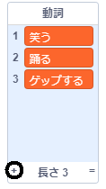
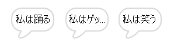

## 解析機関(アナリティカルエンジン)

エイダのコンピュータ(「アナリティカルエンジン」と呼ばれています)が詩を生成するようにプログラムしてみましょう。

\--- task \---

このコードを 'Computer'スプライトに追加して、クリックしたときに読み上げられるようにします。


```blocks3
when this sprite clicked
say [Here is your poem...] for (2) seconds
```

\--- /task \---

\--- task \---

ランダムな詩を作成するには、使用する言葉の**リスト**が最初に必要です。 新しいリストを作成するには、`変数` {:class="block3variables"}タブをクリックします。

詩の最初の行に**動詞**(動きを表す言葉)を使いましょう。 `動詞`{:class="block3variables"}という新しいリストを作成します。

[[[generic-scratch3-make-list]]]

\--- /task \---

\--- task \---

新しいリストには何も入っていません。 空のリストの一番下にある`+`をクリックして次の動詞を追加します。



\--- /task \---

\--- task \---

詩の最初の行は「私は」という単語で始まり、ランダムに選ばれた動詞が続きます。

この一行の詩を作成するには、次のことを行う必要があります。

1. `1`から`動詞リストの長さ`{:class="block3variables"}`までの乱数`の間の{:class = "block3operators"}：
    
    ```blocks3
    (pick random (1) to (length of [verbs v]))
    ```

2. このブロックを使用して`動詞`{:class="block3variables"}リストからランダム`番目`{:class="block3variables"}を取得します：
    
    ```blocks3
    (item (pick random (1) to (length of [verbs v]) :: +) of [verbs v])
    ```

3. 「私は」`と`{:class="block3operators"}ランダムな動詞で詩の最初の行を作成します：
    
    ```blocks3
    (join [I ] (item (pick random (1) to (length of [verbs v])) of [verbs v] :: +))
    ```

4. Use a `say`{:class="block3looks"} block to display the line of poetry:
    
    ```blocks3
    say (join [I ](item (pick random (1) to (length of [verbs v])) of [verbs v]) :: +) for (2) seconds
    ```

Your code should look like this:


```blocks3
when this sprite clicked
say [Here is your poem...] for (2) seconds
+ say (join [I ](item (pick random (1) to (length of [verbs v])) of [verbs v])) for (2) seconds
```

\--- /task \---

\--- task \---

Test your code a few times. Your computer should choose a random word from the `verbs`{:class="block3variables"} list each time.



\--- /task \---