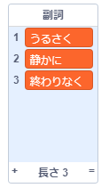

## More poetry

Your poem is quite short - let's add to it!

\--- task \---

Let's use adverbs in the next line of your poem. An **adverb** is a word that describes a verb. 副詞という名前のリストを作成し、次の3つの単語を追加します。



\--- /task \---

\--- task \---

次の行をcomputerのコードに追加して、詩の次の行でランダムな副詞を言うようにしましょう：


```blocks3
when this sprite clicked
say [Here is your poem...] for (2) seconds
say (join [I ](item (pick random (1) to (length of [verbs v])) of [verbs v])) for (2) seconds
+say (item (pick random (1) to (length of [adverbs v])) of [adverbs v]) for (2) seconds
```

\--- /task \---

\--- task \---

Test your code a few times. You should see a random poem each time.


\--- /task \---

\--- task \---

Add a list of nouns to your project. A **noun** is a place or a thing.


\--- /task \---

\--- task \---

Add code to use the nouns in your poem.


```blocks3
when this sprite clicked
say [Here is your poem...] for (2) seconds
say (join [I ](item (pick random (1) to (length of [verbs v])) of [verbs v])) for (2) seconds
say (item (pick random (1) to (length of [adverbs v])) of [adverbs v]) for (2) seconds
+say (join [by the ](item (pick random (1) to (length of [nouns v])) of [nouns v])) for (2) seconds
```

\--- /task \---

\--- task \---

Add a list of adjectives to your project. An **adjective** is a describing word.


\--- /task \---

\--- task \---

Add code to use the adjectives in your poem:


```blocks3
when this sprite clicked
say [Here is your poem...] for (2) seconds
say (join [I ](item (pick random (1) to (length of [verbs v])) of [verbs v])) for (2) seconds
say (item (pick random (1) to (length of [adverbs v])) of [adverbs v]) for (2) seconds
say (join [by the ](item (pick random (1) to (length of [nouns v])) of [nouns v])) for (2) seconds
+ say (join [I feel ](item (pick random (1) to (length of [adjectives v])) of [adjectives v])) for (2) seconds
```

\--- /task \---

\--- task \---

You can click the boxes next to your lists to hide them.


\--- /task \---

\--- task \---

Test out your new poem.

\--- /task \---