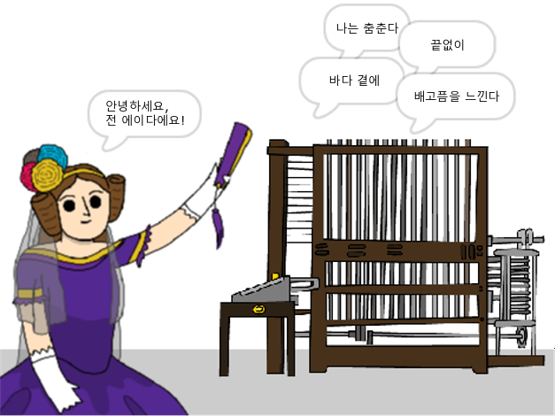

\--- no-print \---

이 프로젝트의 **스크래치 3** 버전입니다. [프로젝트의 스크래치 2 버전](https://projects.raspberrypi.org/en/projects/poetry-generator-scratch2)도 있습니다.

\--- /no-print \---

## 들어가며

이 프로젝트에서는 자신만의 시 생성기를 프로그래밍하는 방법을 배우게 됩니다.

\--- no-print \---

  <iframe allowtransparency="true" width="485" height="402" src="https://scratch.mit.edu/projects/embed/77844926/?autostart=false" frameborder="0" scrolling="no"></iframe>
  

\--- /no-print \---

\--- print-only \---

\--- /print-only \---

## \--- collapse \---

## title: 배우게 될 것

+ 변수
+ 리스트와 랜덤리스트 아이템;
+ 반복 ( `반복`{:class="block3control"} 블록 ) 사용

\--- /collapse \---

## \--- collapse \---

## title: 준비물

#### 하드웨어

+ 스크래치 3를 실행할 수 있는 컴퓨터

#### 소프트웨어

+ 스크래치 3 ([온라인](http://rpf.io/scratchon){:target="_blank"} 또는 [오프라인](http://rpf.io/scratchoff){:target="_blank"})

#### 다운로드

스타터 프로젝트는 [여기](http://rpf.io/p/en/poetry-generator-go){:target="_blank"}를 클릭하면 열 수 있습니다.

\--- /collapse \---

## \--- collapse \---

## title: 교육자를 위한 추가 정보

이 프로젝트는 [Ada Lovelace Day](https://findingada.com)를 기념하기 위해 만들어졌습니다. If you're a teacher, you can download a School Resource Pack which also contains an assembly plan ([downloads.codeclub.org.uk/ada.zip](http://downloads.codeclub.org.uk/ada.zip)), to introduce children to Ada and her revolutionary ideas.

\--- no-print \---

이 프로젝트를 인쇄할 필요가 있다면 [프린트용 버전](https://projects.raspberrypi.org/en/projects/poetry-generator/print){:target="_blank"}을 사용해 주십시오.

\--- /no-print \---

여기서 찾을 수 있습니다 [완료된 프로젝트](http://rpf.io/p/en/poetry-generator-get){:target="_blank"}.

\--- /collapse \---