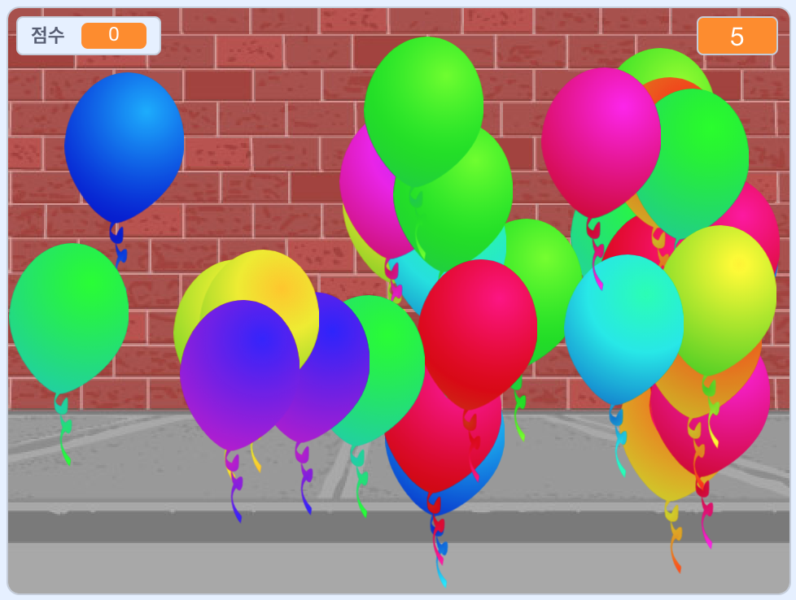

## 더 나아가기

[풍선](https://projects.raspberrypi.org/en/projects/balloons) 스크래치 프로젝트를 살펴 보세요.

\--- no-print \---

풍선을 클릭해서 풍선을 터트릴 수 있습니다.

  <iframe allowtransparency="true" width="485" height="402" src="https://scratch.mit.edu/projects/embed/299206746/?autostart=false" frameborder="0" scrolling="no"></iframe>
  

\--- /no-print \---

\--- print-only \---

\--- /print-only \---