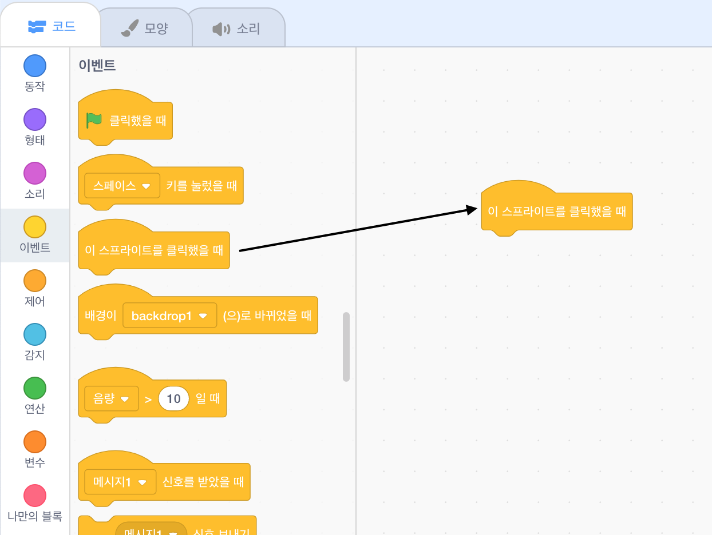
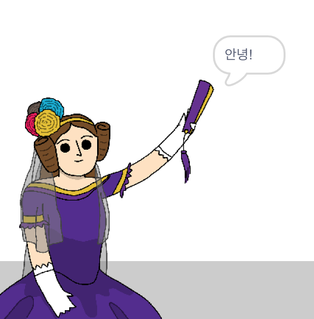

## 에이다 러브레이스

1842년, 에이다 러브레이스는 해석기관이라 불리는 기계를 이용한 계산에 대한 논문을 작성 했으며, 세계 최초의 컴퓨터 프로그래머로 여겨집니다! 또한 에이다는 컴퓨터가 단순한 큰 계산기, 그 이상이 될 수 있음을 처음으로 발견했습니다.

\--- task \---

'시 생성기' 스크래치 스타터 프로젝트를 여세요.

**온라인**: [스타터 프로젝트](http://rpf.io/poetry-on){: target = "_ blank"}을 엽니다.

스크래치 계정이 있는 경우 **Remix를 클릭** 하여 사본을 만들 수 있습니다.

**오프라인**: [스타터 프로젝트](http://rpf.io/p/en/beat-the-goalie-go){:target="_blank"} 를 오프라인 에디터에서 여세요.

스크래치 오프라인 에디터를 다운로드 받아야 하는 경우, [rpf.io/scratchoff](http://rpf.io/scratchoff){:target="_blank"} 에서 다운로드 받을 수 있습니다.

\--- /task \---

\--- task \---

'에이다' 스프라이트를 클릭하고 '스크립트' 코딩 섹션에서 `이벤트`{:class = "block3events"} 탭을 클릭하세요. `이 스프라이트가 클릭되었을 때`{:class="block3events"} 블록을 오른쪽의 코딩 영역으로 드래그 하세요.




이 블록 아래에 추가 된 모든 코드는 에이다 스프라이트를 클릭하면 실행됩니다!

\--- /task \---

\--- task \---

`모양`{:class="block3looks"} 탭을 클릭하여, `안녕!` `을 2초 동안 말하기`{:class="block3looks"} 블록을 드래그하여, `이 스프라이트를 클릭했을 때`{:class="block3events"} 블록 아래에 추가하세요.


```blocks3
when this sprite clicked
say [Hello!] for (2) seconds
```

\--- /task \---

\--- task \---

에이다를 클릭하면 그녀가 당신에게 말하는 것을 볼 수 있습니다.



\--- /task \---