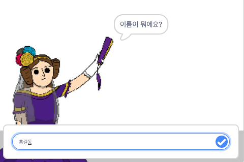
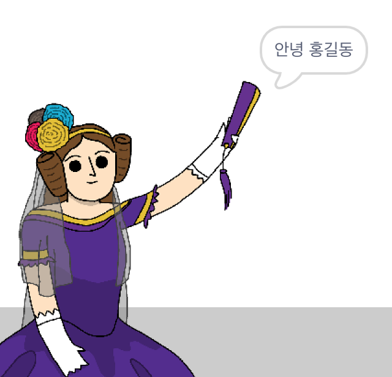

## 에이다에게 자신의 이름을 말하다

에이다는 자기소개를 했지만, 아직 에이다는 당신의 이름을 모릅니다!

\--- task \---

`라고 묻고 기다리기`{: class = "block3sensing"} 블록을 (`감지`{:class="block3sensing"} 섹션 내) 코딩 영역으로 드래그하세요. 코드는 다음과 같이 설계되어야 합니다:


```blocks3
when this sprite clicked
say [Hi, I'm Ada!] for (2) seconds
+ ask [What's your name?] and wait
```

\--- /task \---

\--- task \---

코드를 테스트하려면 에이다 스프라이트를 클릭하세요. 에이다는 당신이 입력할 수 있게 당신의 이름을 물어봐야 합니다!



\--- /task \---

\--- task \---

여러분은 자신의 이름을 저장 하기 위해 **변수** 를 사용해 볼 수 있습니다. `변수`{:class="block3variables"}를 클릭 한 다음 '변수 만들기'를 클릭하세요. 이 변수는 이름을 저장하는 데 사용되므로, 변수를 이렇게 부릅시다... `이름`{:class="block3variables"}!

[[[generic-scratch3-add-variable]]]

\--- /task \---

\--- task \---

여러분의 이름을 저장하려면, `변수`{:class="block3variables"} 탭을 클릭하여, `이름을 ~로 정하기`{:class="block3variables"} 블록을 코드의 끝에 추가하세요.


```blocks3
when this sprite clicked
say [Hi, I'm Ada!] for (2) seconds
ask [What's your name?] and wait
+ set [name v] to [0]
```

\--- /task \---

\--- task \---

입력한 답변을 저장하려면 `대답`{:class="block3sensing"} 블록을 사용하십시오.


```blocks3
when this sprite clicked
say [Hi, I'm Ada!] for (2) seconds
ask [What's your name?] and wait
set [name v] to (answer :: +)
```

\--- /task \---

\--- task \---

코드를 테스트 해보기 위해 에이다를 클릭하고, 물어볼때 이름을 입력하세요. 이름이 `이름`{:class="block3variables"} 변수에 저장되어 있어야합니다.


\--- /task \---

\--- task \---

이제 코드에서 이름을 사용할 수 있습니다. 아래 코드를 추가하세요:


```blocks3
when this sprite clicked
say [Hi, I'm Ada!] for (2) seconds
ask [What's your name?] and wait
set [name v] to (answer)
+say (join [Hi ] (name)) for (2) seconds 
```

이 코드를 만들려면:

1. `결합하기`{:class="blockoperators"} 블록을 `말하기`{:class="blocklooks"} 블록으로 드래그하십시오.
    
    ```blocks3
    say (join [apple] [banana] :: +) for (2) seconds
    ```

2. `이름`{:class="blockdata"} 블록을 `결합하기`{:class="blockoperators"} 블록에 추가하십시오.
    
    ```blocks3
    say (join [Hi] (name :: variables +)) for (2) seconds
    ```

\--- /task \---

\--- task \---

스테이지에서 `이름`{:class="block3variables"} 변수를 숨기려면 변수 옆에 있는 체크박스를 클릭하십시오.


\--- /task \---

\--- task \---

새로워진 여러분의 코드를 테스트해 보세요. 에이다는 당신의 이름을 사용하여 당신에게 인사해야 합니다!



'안녕' 이라는 단어와 이름 사이에 공백이 없으면 코드에 공백을 직접 추가해줘야 합니다.

\--- /task \---

\--- task \---

마지막으로 이 코드를 추가하여 다음에 수행 할 작업을 설명하세요:


```blocks3
when this sprite clicked
say [Hi, I'm Ada!] for (2) seconds
ask [What's your name?] and wait
set [name v] to (answer)
say (join [Hi ] (name)) for (2) seconds 
+ say [Click the computer to generate a poem.] for (2) seconds 
```

\--- /task \---

\--- task \---

마지막으로 에이다 스프라이트 코드를 테스트하여 모든 것이 작동하는지 확인하십시오.

\--- /task \---