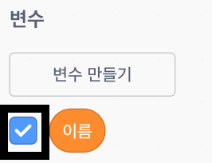

## 에이다에게 자신의 이름을 말하다

에이다는 자기소개를 했지만, 아직 에이다는 당신의 이름을 모릅니다!

\--- task \---

`라고 묻고 기다리기`{: class = "block3sensing"} 블록을 (`감지`{:class="block3sensing"} 섹션 내) 코딩 영역으로 드래그하세요. 코드는 다음과 같이 설계되어야 합니다:


```blocks3
when this sprite clicked
say [Hi, I'm Ada!] for (2) seconds
+ ask [What's your name?] and wait
```

\--- /task \---

\--- task \---

코드를 테스트하려면 에이다 스프라이트를 클릭하세요. Ada should ask you your name, which you can type in!


\--- /task \---

\--- task \---

We can use a **variable** to store your name. Click `Data`{:class="block3variables"}, and then 'Make a Variable'. As this variable will be used to store your name, let's call the variable... `name`{:class="block3variables"}!

[[[generic-scratch3-add-variable]]]

\--- /task \---

\--- task \---

To store your name, click the `Data`{:class="block3variables"} tab, and then drag the `set name`{:class="block3variables"} block onto the end of your code.


```blocks3
when this sprite clicked
say [Hi, I'm Ada!] for (2) seconds
ask [What's your name?] and wait
+ set [name v] to [0]
```

\--- /task \---

\--- task \---

Use the `answer`{:class="block3sensing"} block to store the answer you type in.


```blocks3
when this sprite clicked
say [Hi, I'm Ada!] for (2) seconds
ask [What's your name?] and wait
set [name v] to (answer :: +)
```

\--- /task \---

\--- task \---

Click on Ada to test your code, and enter your name when asked. You should see that your name has been stored in the `name`{:class="block3variables"} variable.


\--- /task \---

\--- task \---

You can now make use of your name in your code. Add this code:


```blocks3
when this sprite clicked
say [Hi, I'm Ada!] for (2) seconds
ask [What's your name?] and wait
set [name v] to (answer)
+say (join [Hi ] (name)) for (2) seconds 
```

To create this code:

1. Drag a `join`{:class="blockoperators"} block onto the `say`{:class="blocklooks"} block
    
    ```blocks3
    say (join [apple] [banana] :: +) for (2) seconds
    ```

2. Add your `name`{:class="blockdata"} block onto the `join`{:class="blockoperators"} block.
    
    ```blocks3
    say (join [Hi] (name :: variables +)) for (2) seconds
    ```

\--- /task \---

\--- task \---

To hide your `name`{:class="block3variables"} variable on the stage, click the tick next to the variable.



\--- /task \---

\--- task \---

Test your new code. Ada should say hello to you, using your name!


If there's no space between the word 'Hi' and your name, you'll need to add a space into the code yourself!

\--- /task \---

\--- task \---

Finally, add this code to explain what to do next:


```blocks3
when this sprite clicked
say [Hi, I'm Ada!] for (2) seconds
ask [What's your name?] and wait
set [name v] to (answer)
say (join [Hi ] (name)) for (2) seconds 
+ say [Click the computer to generate a poem.] for (2) seconds 
```

\--- /task \---

\--- task \---

마지막으로 에이다 스프라이트 코드를 테스트하여 모든 것이 작동하는지 확인하십시오.

\--- /task \---