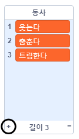

## 해석 기관

시를 생성하기 위해 에이다의 컴퓨터('해석 기관') 를 프로그래밍 해 봅시다!

\--- task \---

아래 코드를 '컴퓨터' 스프라이트에 추가하여, 클릭할 때 소리가 나도록 하세요:


```blocks3
when this sprite clicked
say [Here is your poem...] for (2) seconds
```

\--- /task \---

\--- task \---

임의의 시를 제작하려면, 어떤 단어를 사용할지에 대한 **리스트** 가 필요합니다. 새로운 리스트를 만들기 위해서는 `변수`{:class="block3variables"} 탭을 클릭하세요.

**동사** (행동 단어들) 를 시의 첫번째 줄에 사용합시다. `동사`{:class="block3variables"} 리스트를 새로 만들어 보세요.

[[[generic-scratch3-make-list]]]

\--- /task \---

\--- task \---

여러분의 새 리스트는 비어있을 것입니다. 비어있는 리스트 아래쪽의 `+` 버튼을 클릭하여 이 동사들을 추가하세요:



\--- /task \---

\--- task \---

시의 첫 번째 줄은 무작위 동사가 붙은 "나" 라는 단어이어야 합니다.

이 시를 만들려면 이렇게 해 보세요:

1. `~부터 ~사이의 난수`{:class="block3operators"} 블록을 사용하여 `1` 부터 `동사 리스트의 길이`{:class="block3variables"} 사이의 난수를 출력하도록 합니다.
    
    ```blocks3
    (pick random (1) to (length of [verbs v]))
    ```

2. 무작위로 `아이템`{:class="block3variables"} 을 `동사`{:class="block3variables"} 리스트에서 가져오기 위해 이 블럭을 사용하세요:
    
    ```blocks3
    (item (pick random (1) to (length of [verbs v]) :: +) of [verbs v])
    ```

3. `~와(과) ~결합하기`{:class="block3operators"} 블록으로 "나" 와 무작위 동사를 결합해 시의 첫 줄을 만듭니다:
    
    ```blocks3
    (join [I ] (item (pick random (1) to (length of [verbs v])) of [verbs v] :: +))
    ```

4. `말하기`{:class="block3looks"} 블록을 사용하여 시의 라인을 출력할 수 있도록 하세요:
    
    ```blocks3
    say (join [I ](item (pick random (1) to (length of [verbs v])) of [verbs v]) :: +) for (2) seconds
    ```

여러분의 코드는 이런 모습이어야 합니다:


```blocks3
when this sprite clicked
say [Here is your poem...] for (2) seconds
+ say (join [I ](item (pick random (1) to (length of [verbs v])) of [verbs v])) for (2) seconds
```

\--- /task \---

\--- task \---

여러분의 코드를 여러번 테스트해보세요. 컴퓨터는 `동사`{:class="block3variables"} 리스트에서 항상 랜덤한 단어를 선택해야 합니다.


\--- /task \---