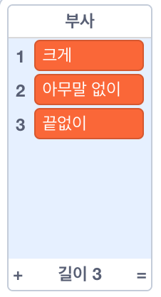
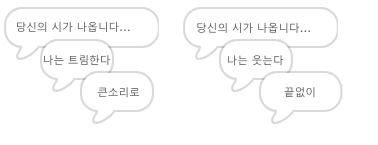
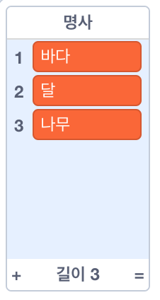
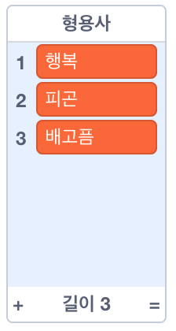
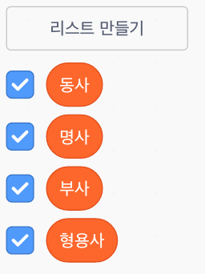

## 더 많은 시

당신의 시는 상당히 짧아요 - 좀 더 더해 봅시다!

\--- task \---

시의 다음 줄에서는 부사를 사용해 볼 것입니다. **부사**는 동사를 묘사하는 단어입니다. 부사라는 다른 리스트를 만들고 이 세 단어를 추가하세요.



\--- /task \---

\--- task \---

아래 라인을 코드에 추가하여 시의 다음 줄에 임의의 부사를 말하도록 합시다.


```blocks3
when this sprite clicked
say [Here is your poem...] for (2) seconds
say (join [I ](item (pick random (1) to (length of [verbs v])) of [verbs v])) for (2) seconds
+say (item (pick random (1) to (length of [adverbs v])) of [adverbs v]) for (2) seconds
```

\--- /task \---

\--- task \---

이제 이 코드를 여러번 테스트해보세요. 당신은 이제 매번 무작위의 시를 볼 것입니다.



\--- /task \---

\--- task \---

명사 목록을 프로젝트에 추가하세요. ** 명사 ** 는 장소 또는 사물을 나타내는 품사입니다.



\--- /task \---

\--- task \---

아래 코드를 추가하여 시에서 명사를 사용할 수 있도록 하세요.


```blocks3
when this sprite clicked
say [Here is your poem...] for (2) seconds
say (join [I ](item (pick random (1) to (length of [verbs v])) of [verbs v])) for (2) seconds
say (item (pick random (1) to (length of [adverbs v])) of [adverbs v]) for (2) seconds
+say (join [by the ](item (pick random (1) to (length of [nouns v])) of [nouns v])) for (2) seconds
```

\--- /task \---

\--- task \---

Add a list of adjectives to your project. An **adjective** is a describing word.



\--- /task \---

\--- task \---

Add code to use the adjectives in your poem:


```blocks3
when this sprite clicked
say [Here is your poem...] for (2) seconds
say (join [I ](item (pick random (1) to (length of [verbs v])) of [verbs v])) for (2) seconds
say (item (pick random (1) to (length of [adverbs v])) of [adverbs v]) for (2) seconds
say (join [by the ](item (pick random (1) to (length of [nouns v])) of [nouns v])) for (2) seconds
+ say (join [I feel ](item (pick random (1) to (length of [adjectives v])) of [adjectives v])) for (2) seconds
```

\--- /task \---

\--- task \---

You can click the boxes next to your lists to hide them.



\--- /task \---

\--- task \---

Test out your new poem.

\--- /task \---