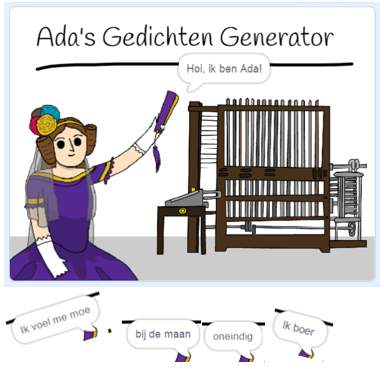

\--- no-print \---

Dit is de **Scratch 3** versie van het project. Er is ook een [Scratch 2 versie van dit project](https://projects.raspberrypi.org/en/projects/poetry-generator-scratch2).

\--- /no-print \---

## Inleiding

Je gaat leren hoe je je eigen poëzegenerator kunt programmeren!

\--- no-print \---

  <iframe allowtransparency="true" width="485" height="402" src="https://scratch.mit.edu/projects/embed/77844926/?autostart=false" frameborder="0" scrolling="no"></iframe>
  

\--- /no-print \---

\--- print-only \---

\--- /print-only \---

## \--- collapse \---

## title: Wat ga je leren

+ Variabelen;
+ Lijsten en willekeurige lijstitems;
+ Herhaling (het `herhaal`{:class="block3control"} blok).

\--- /collapse \---

## \--- collapse \---

## title: Wat heb je nodig

#### Hardware

+ Een computer die Scratch 3 kan uitvoeren

#### Software

+ Scratch 3 ([online](http://rpf.io/scratchon){:target="_blank"} of [offline](http://rpf.io/scratchoff){:target="_blank"})

#### Downloads

Het startproject kan [hier](http://rpf.io/p/en/poetry-generator-go){:target="_blank"} gevonden worden.

\--- /collapse \---

## \--- collapse \---

## title: Aanvullende informatie voor docenten

Dit project is gemaakt om [Ada Lovelace dag](https://findingada.com)te vieren. Als je een leraar bent, kun je een School Resource Pack downloaden dat ook een plan bevat ([downloads.codeclub.org.uk/ada.zip](http://downloads.codeclub.org.uk/ada.zip)) om kinderen kennis te laten maken met Ada en haar revolutionaire ideeën.

\--- no-print \---

Als je dit project wilt afdrukken, gebruik dan de [printervriendelijke versie](https://projects.raspberrypi.org/en/projects/poetry-generator/print) {:target="_ blank"}.

\--- /no-print \---

Je kunt het [voltooide project hier](http://rpf.io/p/en/poetry-generator-get)"{:target="_blank"} vinden.

\--- /collapse \---